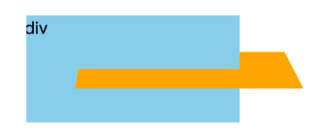

# 邂逅数据可视化

什么是数据可视化？

- 数据可视化（英语：Data visualization），主要旨在借助于图形化手段，清晰有效地传达与沟通信息。
- 通常使用柱状图、折线图、饼图、玫瑰图、散点图等图形来传递信息。
- 也可以使用点、线、面、地图来对数字数据进行编码展示，以便在视觉上快速传达关键信息。

有什么用？

- 帮助用户分析和推理数据，让复杂的数据更容易理解和使用，有利于做出决策。

数据可视化前：


数据可视化后：

案例一：


案例二：


# 可视化的发展历史。

萌芽阶段：

- 17世纪以前
	- 早在17世纪以前，可视化就开始萌芽了，其中最早的地图在公元前6200年于土耳其地区出现。
	- 现代考古发现我国最早的地图实物，是出土于甘肃天水放马滩战国墓地一号墓中的《放马滩地图》
- 17-19世纪
	- 17世纪末随着几何兴起、坐标系、以及人口统计学开端，人类开始了可视化思考的新模式，从此标记可视化的开端。
	- 1800-1849年：随着工艺设计的完善，统计图形爆炸性增长，包括柱状图, 饼图, 直方图, 折线图等。
	- 1826年，查尔斯·杜品发明了使用连续黑白底纹来显示法国识字分布，这可能是第一张现代形式主题统计地图。


黄金阶段：

- 19世纪中
	- 1850-1899：人们开始认识到数字信息对社会计划，工业化，商业和运输的重要性，此时统计理论开始诞生。
	- 1869年查尔斯·约瑟夫·米纳德，发布的拿破仑对1812年俄罗斯东征事件流图，被誉为有史以来最好的数据可视化。
		- 他的流图呈现了拿破仑军队的位置和行军方向、军队汇集、分散和重聚的时间和地点等信息。
	- 1879年 Luigi Perozzo 绘制立体图（三维人口金字塔）。标记着可视化开始进入了三维立体图。


重生阶段

- 20世纪
	- 1950-1974年：引领这次大潮的，首先是一个划时代的事件——计算机的诞生。
	- 计算机的出现彻底地改变了数据分析工作，计算机高分辨率和交互式的图形分析，提供了手绘时代无法实现的表现能力。
	- 随着统计应用的发展，数理统计把数据可视化变成了一门科学（如：计算机图形学、统计学、分析学），并运用到各行各业。
	- 1969年 John W. Tukey 在探索数据分析的图形时，发明箱型图。
	- 1982年乔治·罗里克（George Rorick）绘制彩色天气图开创了报纸上的彩色信息图形时代。
	- 1996年 Jason Dykes 发明了制图工具：一种地图可视化工具包，可以实时查看数据的图形工具。


分析学阶段

- 2004年至今
	- 以前可视化难以应对海量、高维、多源的动态数据的分析，进入21世纪，随着计算机的升级，对于以前难以应对数据，可以 借用计算机来综合可视化、图形学、数据挖掘理论与方法来研究新的科学理论模型。通过这种模型来辅助用户从海量、复杂、 矛盾的数据中快速挖掘出有用的数据，做出有效决策，这门新兴学科称为可视化分析学。
	- 可视化分析现在已大量应用在地图、物流、电力、水利、环保、交通、医学、监控、预警等领域。可视化分析降低了数据理解的难度，突破了常规统计分析的局限性。如下交通拥挤分析图。随着大数据的应用，如今可视化开发也变得越来越重要了。


# 数据可视化的应用场景。

- 如淘宝双十一活动时，借助于数据可视化展示公司实时交易数额，并可以实时动态观察。
- 交管部门可实现对交通形态、卡口数据统计、违章分析、警力部署、出警分析、行车轨迹分析等智能交通大数据分析。
- 企业各层可以借助数据可视化工具，可以直接在手机等设备上远程查看业务运营数据状况和关键指标。
- 医院可以利用数据可视化工具，对医疗卫生数据进行可视化分析和研究应用，进而获取医疗卫生数据隐藏的价值。


# 数据可视化有哪些解决方案？它们之间有什么关系？

前端可视化技术

- 底层图形引擎： 【Skia（2D\2.5D）】 、【OpenGL（善于绘制 3D 图形）】等。
- W3C提供：【CSS3】、【Canvas、SVG（基于 Skia）】、【WebGL（基于 OpenGL）】。
- 第三方的可视化库： 【ZRender、Echarts、 AntV 、Highcharts、D3.js（基于Canvas、SVG）】 、【Three.js、百度地图、高德地图（基于 WebGL）】等等。
- 低代码可视化平台：阿里云（DataV）、腾讯云图、网易有数（EasyScreen）、帆软等。

# 回顾 CSS3 中的 2D 形变

## transform

如何对元素产生 2D 形变。

- 使用 CSS3 transform 属性，允许对元素进行平移、旋转、缩放、倾斜的形变。
- 常见的函数 transform function 有：
	- 平移：`translate(x, y) `
	- 缩放：`scale(x, y) `
	- 旋转：`rotate(deg)`
	- 倾斜：`skew(deg, deg)`

什么是元素的坐标系？

- CSS 中的每个元素都有一个坐标系，其原点位于元素的左上角，左上角这被称为初始坐标系。
- 用 transform 属性形变元素，会改变元素的坐标系。并且该元素所有后续形变都将基于改变后的新坐标系。
- 因此，transform 属性中形变函数的顺序非常重要，不同的顺序会导致不同的形变结果。


元素形变中坐标系又是怎样的？

- 用 transform 时，坐标系的原点默认会移动到元素的中心。
- 用 transform 属性形变的元素会受 transform-origin 属性值的影响，该属性用于指定形变的原点。
- 因为 transform-origin 属性的默认值为 50% 50%，即该原点将会作为变换元素的中心点。


案例理解：

```html
<!DOCTYPE html>
<html lang="en">
<head>
  <meta charset="UTF-8">
  <meta http-equiv="X-UA-Compatible" content="IE=edge">
  <meta name="viewport" content="width=device-width, initial-scale=1.0">
  <title>Document</title>
  <style>
    body{
      margin: 0;
      padding: 0;
      background-image: url(../images/grid.png);
    }
    .box{
      width: 200px;
      height: 100px;
      background-color: skyblue;
      transition: transform 200ms ease;

    }
    .box:hover {
      /* 形变：两个完全不同的形变结果。 */
      transform: translateX(100px) rotate(45deg);
      transform: rotate(45deg) translateX(100px);
    }
  </style>
</head>
<body>
  <div class="box">div</div>
</body>
</html>
```

## transform-origin

transform-origin 可以如何赋值？

- 一个值：设置 x轴 的原点，y轴 为默认值 50%。
- 两个值：设置 x轴 和 y轴 的原点
- 三个值：设置 x轴、 y轴 和 z轴 的原点

必须是`<length>`，`<percentage>`，或 `left`, `center`, `right`, `top`, `bottom` 关键字中的一个：

- length：从左上角开始计算；
- percentage：参考元素本身大小。

案例理解：

```html
<!DOCTYPE html>
<html lang="en">
<head>
  <meta charset="UTF-8">
  <meta http-equiv="X-UA-Compatible" content="IE=edge">
  <meta name="viewport" content="width=device-width, initial-scale=1.0">
  <title>Document</title>
  <style>
    body{
      margin: 0;
      padding: 0;
      background-image: url(../images/grid.png);
    }
    .box{
      width: 200px;
      height: 100px;
      background-color: skyblue;

      /* left -> 0, 50% */
      /* bottom -> 50%, 100% */
      /* 修改坐标的原点 */
      transform-origin: bottom;

      /* 形变 */
      transform: rotate(45deg);
    }
  </style>
</head>
<body>

  <div class="box">div</div>
</body>
</html>
```

# CSS3 中的 3D 形变

CSS3 transform 属性不但允许你进行 2D 的旋转，缩放或平移指定的元素，还支持 3D 变换元素。

常见的函数 transform function 有：

- 平移：`translate3d(tx, ty, tz)`
	- `translateX(tx)`、`translateY(ty)`、`translateZ(tz)`
- 缩放：`scale3d(sx, sy, sz)`
	- `scaleX(sy)`、`scaleY(sy)`、`scaleZ(sz)`
- 旋转：`rotate3d(x, y, z, a)`
	- `rotateX(x)`、`rotateY(y)`、`rotateZ(z)`

> 3D 形变函数会创建一个合成层来启用 GPU 硬件加速

## 3D 旋转

将元素围绕固定轴旋转。旋转量由指定的角度确定; 为正，旋转将为顺时针，为负，则为逆时针。

旋转的原点受 transform-origin 影响

简写：`rotate3d(x, y, z, deg)`

- 一个值时，表示 z轴 旋转的角度；
- 四个值时，表示在 3D 空间之中，旋转有 x,y,z 个旋转轴和一个旋转角度。
	- x：<number> 类型，可以是 0 到 1 之间的数值，表示旋转轴 X 坐标方向的矢量( 用来计算形变矩阵中的值 )。
	- y：<number> 类型，可以是 0 到 1 之间的数值，表示旋转轴 Y 坐标方向的矢量。
	- z：<number> 类型，可以是 0 到 1 之间的数值，表示旋转轴 Z 坐标方向的矢量。
	- a：<angle> 类型，表示旋转角度。正的角度值表示顺时针旋转，负值表示逆时针旋转。

旋转函数，最终会生成一个 4*4 的矩阵：


## 3D 透视

透视属性 perspective，

- 定了观察者与 z=0 平面的距离，使具有三维位置变换的元素产生透视效果（z表示Z轴）。
- z>0 的三维元素比正常的大，而 z<0 时则比正常的小，大小程度由该属性的值决定。


透视的两种使用方式：

- 1.在父元素上定义 CSS 透视属性；
- 2.如果它是子元素或单元素子元素，可以使用函数 `perspective()`；

必须是 <none> <length> 中的一个

- none：没有应用 perspective 样式时的默认值。
- length：观察者距离 z=0 平面的距离(如上图 d 的距离，单位 px)。
	- 为元素及其内容应用透视变换。当值为 0 或负值时，无透视变换。

[透视演练场1](https://codepen.io/mburakerman/pen/wrZKwe)、[透视演练场2](https://codepen.io/enxaneta/pen/ZQbNMx)

案例一，在父元素中使用透视：

```html
<!DOCTYPE html>
<html lang="en">
<head>
  <meta charset="UTF-8">
  <meta http-equiv="X-UA-Compatible" content="IE=edge">
  <meta name="viewport" content="width=device-width, initial-scale=1.0">
  <title>Document</title>
  <style>
    body{
      margin: 0;
      padding: 0;
      background-image: url(../images/grid.png);
    }
    .box{
      position: relative;
      width: 200px;
      height: 100px;
      background-color: skyblue;

      /* 在父元素添加透视效果 */
      perspective: 200px;
    }

    .item{
      position: absolute;
      top: 0;
      left: 0;
      width: 100%;
      height: 100%;
      background-color: pink;
      /* 形变 */
      transform: rotateY(60deg);
    }
  </style>
</head>
<body>
  <div class="box">div
    <div class="item">10</div>
  </div>
</body>
</html>
```

案例二，在当前元素中使用透视：

```html
<!DOCTYPE html>
<html lang="en">
<head>
  <meta charset="UTF-8">
  <meta http-equiv="X-UA-Compatible" content="IE=edge">
  <meta name="viewport" content="width=device-width, initial-scale=1.0">
  <title>Document</title>
  <style>
    body{
      margin: 0;
      padding: 0;
      background-image: url(../images/grid.png);
    }
    .box{
      position: relative;
      width: 200px;
      height: 100px;
      background-color: skyblue;

      /* 在当前元素中直接添加透视效果 */
      transform: perspective(200px) rotateY(60deg);
    }
  </style>
</head>
<body>
  <div class="box">div
  </div>
</body>
</html>
```

## 3D 位移

平移：`translateX(tx)`、`translateY(ty)`、`translateZ(tz)`

只有一个值，设置对应轴上的位置。

- 数字：如 100px；
- 百分比：参照元素本身（ refer to the size of bounding box）。

简写：`translate3d(tx, ty, tz)`

- tx：是一个 <length> 代表移动向量的横坐标。
- ty：是一个 <length> 代表移动向量的纵坐标。
- tz：是一个 <length> 代表移动向量的 z 坐标。它不能是 <percentage> 值；那样的移动是没有意义的。

注意：

- translateX(tx) 等同于 translate(tx, 0) 或者 translate3d(tx, 0, 0)。
- translateY(ty) 等同于 translate(0, ty) 或者 translate3d(0, ty, 0)。
- translateZ(zx) 等同于 translate3d(0, 0, tz)。

案例理解：

```html
<!DOCTYPE html>
<html lang="en">
<head>
  <meta charset="UTF-8">
  <meta http-equiv="X-UA-Compatible" content="IE=edge">
  <meta name="viewport" content="width=device-width, initial-scale=1.0">
  <title>Document</title>
  <style>
    body{
      margin: 0;
      padding: 0;
      background-image: url(../images/grid.png);
    }
    .box{
      width: 200px;
      height: 100px;
      background-color: skyblue;

      /* 形变，与透视结合使用，在 z 轴上平移，最终效果看上去放大了一倍 */
      transform: perspective(300px) translateZ(200px);
    }
  </style>
</head>
<body>
  <div class="box">div</div>
</body>
</html>
```

## 3D 缩放。

缩放：`scaleX(sy)`、`scaleY(sy)`、`scaleZ(sz)`

指定了一个沿 x、y、z 轴调整元素缩放比例因子。

一个值时，设置对应轴上的缩放（无单位）

- 数字：
	- 1：保持不变
	- 2：放大一倍
	- 0.5：缩小一半
- 不支持百分比。


简写：`scale3d(sx, sy, sz)`

- sx：是一个<number>代表缩放向量的横坐标。
- sy：是一个<number>表示缩放向量的纵坐标。
- sz：是<number>表示缩放向量的 z 分量的 a（在后续介绍的 3D 正方体中演示）。

注意：

- scaleX(sx) 等价于 scale(sx, 1) 或 scale3d(sx, 1, 1) 。
- scaleY(sy) 等价于 scale(1, sy) 或 scale3d(1, sy, 1)。
- scaleZ(sz) 等价于 scale3d(1, 1, sz)。

案例理解：

```html
<!DOCTYPE html>
<html lang="en">
<head>
  <meta charset="UTF-8">
  <meta http-equiv="X-UA-Compatible" content="IE=edge">
  <meta name="viewport" content="width=device-width, initial-scale=1.0">
  <title>Document</title>
  <style>
    body{
      margin: 0;
      padding: 0;
      background-image: url(../images/grid.png);
    }
    .box{
      width: 200px;
      height: 100px;
      background-color: skyblue;

      /* 形变 */
      transform: scaleX(2) scaleY(2);
      /* 等价于 */
      transform: scale3d(2, 2, 1);
      transform-origin: 0 0;
    }
  </style>
</head>
<body>
  <div class="box">div</div>
</body>
</html>
```

# CSS3 中的 3D 空间

变换式：transform-style，在父元素中使用。

- 该 CSS 属性用于设置元素的子元素是定位在 3D 空间中还是平展在元素的 2D 平面中。
- 在 3D 空间中同样是可以使用透视效果。

值类型：

- `flat`：指示元素的子元素位于元素本身的平面内。
- `preserve-3d`：指示元素的子元素应位于 3D 空间中（如下图）。



案例理解：

```html
<!DOCTYPE html>
<html lang="en">
<head>
  <meta charset="UTF-8">
  <meta http-equiv="X-UA-Compatible" content="IE=edge">
  <meta name="viewport" content="width=device-width, initial-scale=1.0">
  <title>Document</title>
  <style>
    body{
      margin: 0;
      padding: 0;
      background-image: url(../images/grid.png);
    }
    .box{
      position: relative;
      width: 200px;
      height: 100px;
      background-color: skyblue;
      
      /* 在父元素中添加 transform-style 来启用3D空间 */
      transform-style: preserve-3d;
      /* 在父元素添加透视效果 */
      perspective: 300px;

    }

    .item{
      position: absolute;
      top: 0;
      left: 0;
      width: 100%;
      height: 100%;
      background-color: pink;

      /* 形变 */
      transform: rotateX(70deg) translateX(50px);
    }
  </style>
</head>
<body>
  
  <div class="box">div
    <div class="item">10</div>
  </div>
</body>
</html>
```