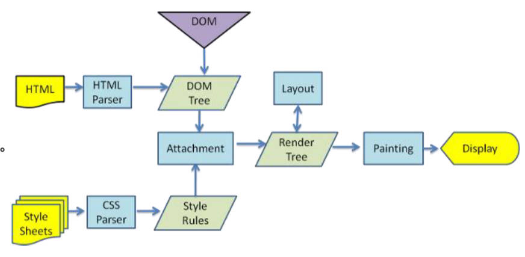

# 一、3D空间

## 1.绘制正方体

绘制正方体的侧面图（在父元素中，搭建"舞台"）。

绘制正方体的6个面，由侧面图形变为6个面。

使用定位元素，来绘制正方体的6个面；

- 这样做保证每个面，都能脱离标准流；
- 能在新的渲染层中创建，
- 执行动画时，不会影响其它元素。

```html
<!DOCTYPE html>
<html lang="en">
<head>
  <meta charset="UTF-8">
  <meta http-equiv="X-UA-Compatible" content="IE=edge">
  <meta name="viewport" content="width=device-width, initial-scale=1.0">
  <title>Document</title>
  <style>
    body{
      margin: 0;
      padding: 100px;
      background-image: url(../images/grid.png);
    }

		/* 搭建舞台 */
    .box{
      position: relative;
      width: 100px;
      height: 100px;
      background-color: red;

      /* 在父元素中添加 transform-style 来启用 3D 空间 */
      transform-style: preserve-3d;
      transform: rotateX(-33.5deg) rotateY(45deg) scaleZ(2); /* 拉伸成为长方体 */
    }

    .item{
      position: absolute;
      top: 0;
      left: 0;
      width: 100%;
      height: 100%;
    }

    .top{
      background-color: rgba(255, 0, 0, 0.4);
      transform: rotateX(90deg) translateZ(50px);
    }
    .bottom{
      background-color: rgba(0, 255, 0, 0.4);
      transform: rotateX(-90deg) translateZ(50px);
    }

    .front{
      background-color: rgba(100, 100, 100, 0.4);
      transform: rotateY(0deg) translateZ(50px);
    }

    .back{
      background-color: rgba(0, 255, 255, 0.4);
      transform: rotateY(-180deg) translateZ(50px);
    }

    .left{
      background-color: rgba(255, 255, 0, 0.4);
      transform: rotateY(-90deg) translateZ(50px);
    }
    .right{
      background-color: rgba(0, 0, 255, 0.4);
      transform: rotateY(90deg) translateZ(50px);
    }

  </style>
</head>
<body>

  <!-- 父元素(舞台) -->
  <div class="box">div
    <!-- 子元素 -->
    <div class="item top">1</div>
    <div class="item bottom">2</div>
    <div class="item front">3</div>
    <div class="item back">4</div>
    <div class="item left">5</div>
    <div class="item right">6</div>
  </div>
</body>
</html>
```

# 二、3D 背面可见性

背面可见性属性：`backface-visibility`

- 该 CSS 属性 backface-visibility 指定某个元素当背面朝向观察者时是否可见。

值类型：

- `visible`：背面朝向用户时可见。
- `hidden`：背面朝向用户时不可见。

案例理解

```html
<!DOCTYPE html>
<html lang="en">
<head>
  <meta charset="UTF-8">
  <meta http-equiv="X-UA-Compatible" content="IE=edge">
  <meta name="viewport" content="width=device-width, initial-scale=1.0">
  <title>Document</title>
  <style>
    body{
      margin: 0;
      padding: 0;
      background-image: url(../images/grid.png);
    }
    .box{
      position: relative;
      width: 200px;
      height: 100px;
      background-color: skyblue;

      /* 在父元素添加透视效果 */
      perspective: 800px;
    }

    .item{
      position: absolute;
      top: 0;
      left: 0;
      width: 100%;
      height: 100%;
      background-color: pink;

      /* 元素背向是否可见 */
      backface-visibility: hidden;
      /* 帧动画，当旋转 180° 后，item 不可见了 */
      animation: loop 6s linear infinite;
    }

    @keyframes loop{
      0%{
        transform: rotateY(0deg);
      }

      100%{
        transform: rotateY(-360deg);
      }
    }
  </style>
</head>
<body>
  <div class="box">div
    <div class="item">10</div>
  </div>
</body>
</html>
```

# 三、3D 动画案例

## 1.制作 webpack logo

结合帧动画实现。

01-CSS3-3D动画\demo-project\01-webpack-logo\index.html

# 四、2.5D 动画案例

## 1.酷屏动画实现

01-CSS3-3D动画\demo-project\02-数据平台2.5D动画\index.html

# 五、浏览器渲染流程（回顾）

1. 解析 HTML，构建 DOM Tree；
2. 对 CSS 文件进行解析，解析出对应的规则树；
3. DOM Tree + CSSOM 生成 Render Tree；
4. 布局（Layout）：计算出每个节点的宽度、高度和位置信息。
	- 页面元素位置、大小发生变化，往往会导致其他节点联动，需要重新计算布局，这个过程称为回流（Reflow）。
5. 绘制（Paint）：将可见的元素绘制在屏幕中。
	- 默认标准流是在同一层上绘制，一些特殊属性会创建新的层进行绘制，这些层称为**渲染层**。
	- 一些不影响布局的 CSS 修改也会导致该渲染层重绘（Repaint）;
	- 回流必然会导致重绘。

> Composite 合成层：
>
> - 一些特殊属性会创建一个合成层（Compositing Layer）
> - 它可以利用 GPU 来加速绘制，是浏览器的一种优化手段。
> - 合成层确实可以提高性能，但是它以消耗内存为代价，因此不能作为 web 性能优化策略和过度使用。



# 六、CSS3 动画性能优化

什么情况下会创建一个新的渲染层（减少回流）

- CSS 有明确的定位属性（`relative`、`fixed`、`sticky`、`absolute`）；
- CSS 透明度 `opacity` 小于 1；
- CSS `transform` 属性不为 `none`;
- CSS 对于 `opacity`、`transform`、`fliter`、`backdrop-filter` 应用 `animation` 或 `transition`
- CSS `backface-visibility` 属性为 `hidden`
- ....

什么情况下会创建合成层。合成层会开始 GPU 加速页面渲染，但不能滥用:

- CSS 应用了 3D `transform` 函数：
  - 比如：`translate3d`、`translateZ`、`scale3d`、`rotate3d` ...

- html 中使用了 `<video>`、`<canvas>`、`<iframe>` 等元素的。

- CSS 对于 `opacity`、`transform`、`fliter`、`backdrop-filter` 应用了 `animation` 或 `transition`；

- CSS `will-change` 设置为 `opacity`、`transform`、`top`、`left`、`bottom`、`right`
  - 比如：`will-change: opacity, transform;`;
	- 其中 `top`、`left` 等需要设置明确的定位属性，如 `relative` 等。

- CSS 设置了 `position: fixed;` 的。

少用高斯模糊特效，比较耗费内存。

如果代码实现动画卡顿，考虑使用图片或视频代替。

