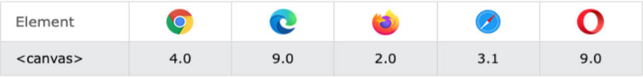
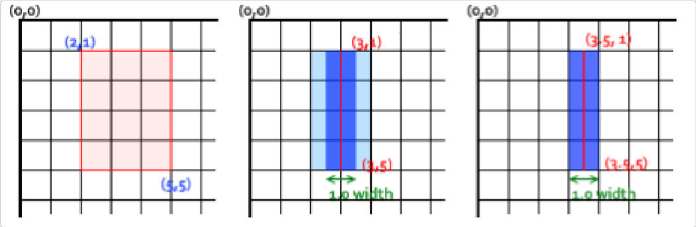
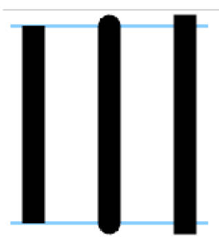
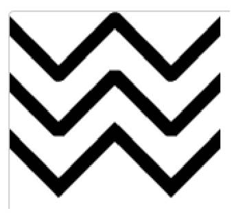

# 认识 Canvas

什么是 Canvas？

- Canvas 最初由 Apple 于 2004 年引入，用于 MacOS X WebKit 组件，为仪表板小部件和 Safari 浏览器等应用程序提供支持。后来，它被 Gecko 内核的浏览器（尤其是 Mozilla Firefox），Opera 和 Chrome 实现，并被网页超文本应用技术工作小组提议为下一代的网络技术的标准元素（HTML5新增元素）。
- Canvas 提供了非常多的 JavaScript 绘图 API（比如：绘制路径、矩形、圆、文本和图像等方法），与 `<canvas>` 元素结合可以绘制各种 2D 图形。
- Canvas API 主要聚焦于 2D 图形。当然也可以使用 <canvas> 元素对象的 WebGL API 来绘制 2D 和 3D 图形。

有哪些应用场景？兼容性如何？

- 可以用于动画、游戏画面、数据可视化、图片编辑以及实时视频处理等方面。



Canvas 优点：

- Canvas 提供的功能更原始，适合像素处理，动态渲染和数据量大的绘制，如：图片编辑、热力图、炫光尾迹特效等。
- Canvas 非常适合图像密集型的游戏开发，适合频繁重绘许多的对象。
- Canvas 能够以 .png 或 .jpg 格式保存结果图像，适合对图片进行像素级的处理。

Canvas 缺点：

- 在移动端可能会因为 Canvas 数量多，而导致内存占用超出了手机的承受能力，导致浏览器崩溃。
- Canvas 绘图只能通过 JavaScript 脚本操作（all in js）。
- Canvas 是由一个个像素点构成的图形，放大会使图形变得颗粒状和像素化，导致模糊。

# Canvas 初体验

使用 Canvas 的注意事项：

- `<canvas>` 和 `` 元素很相像，唯一的不同就是它并没有 `src` 和 `alt` 属性。
- `<canvas>` 标签只有两个属性 `width` 和 `height`（单位默认为 px）；当没有设置宽度和高度时，canvas 会初始化宽为 300px 和高为 150px。
- 与 `` 元素不同，`<canvas>` 元素必须有结束标签`</canvas>`。如结束标签不存在，则文档其余部分会被认为是替代内容，将不会显示出来。
- 测试 `canvas.getContext` 方法的存在，可以检查浏览器是否支持 Canvas。

使用 Canvas 的通用模板：

```html
<!DOCTYPE html>
<html lang="en">
<head>
	<meta charset="UTF-8">
	<meta http-equiv="X-UA-Compatible" content="IE=edge">
	<meta name="viewport" content="width=device-width, initial-scale=1.0">
	<title>Document</title>
	<style>
		canvas {
			background-color: rgba(255, 0, 0, 0.1);
		}
	</style>
</head>
<body>

	<canvas id="tutorial" width="300" height="300">
		您的浏览器不支持Canvas
	</canvas>

	<script>
		window.onload = function() {
			// 1.查找 canvas 的元素对象
			const canvasEl = document.getElementById('tutorial')
			if (!canvasEl.getContext) return
			// 2.拿到 Canvas 渲染的上下文
      // ctx: CanvasRenderingContext2D
      // ctx 是一个绘图的上下文: 提供了绘图的指令, 可以绘制各种图形(圆形、直线、椭圆... )
			const ctx = canvasEl.getContext('2d') // 2d | webgl
			console.log('ctx:', ctx)
		}
	</script>
</body>
</html>
```

使用 Canvas 绘制一个矩形：

```html
<!DOCTYPE html>
<html lang="en">
<head>
	<meta charset="UTF-8">
	<meta http-equiv="X-UA-Compatible" content="IE=edge">
	<meta name="viewport" content="width=device-width, initial-scale=1.0">
	<title>Document</title>
	<style>
		body {
			margin: 0;
			padding: 0;
			background-image: url(../images/grid.png);
		}
		canvas {
			background-color: rgba(255, 0, 0, 0.1);
		}
	</style>
</head>
<body>

	<canvas id="tutorial" width="300" height="300">
		你的浏览器不兼容Canvas
	</canvas>

	<script>
		window.onload = function() {
			const canvasEl = document.getElementById('tutorial')
			if (!canvasEl.getContext) return
			const ctx = canvasEl.getContext('2d')
			ctx.fillRect(0, 0, 100, 50) // 坐标点x，坐标点y，长，宽
		}
	</script>
</body>
</html>
```

# 什么是 Canvas 中的网格（Grid）

Canvas 中的网格，也称为坐标系、坐标空间：

- `<canvas>` 元素默认被网格所覆盖。
- 通常来说网格中的一个单元相当于 canvas 元素中的一像素。
- 该网格的原点位于坐标 (0,0) 的左上角。所有元素都相对于该原点放置。
- 坐标 (0,0) 也被称为初始坐标系。
- 网格或坐标空间是可以变换的，后面会介绍如何将原点转换到不同的位置，旋转网格甚至缩放它。
	- 注意：移动了原点后，后续变换都将基于新坐标系的变换。

# Canvas 中绘制矩形的方式有哪些？

Canvas 支持两种方式来绘制矩形：**矩形方法**和**路径方法**。

- 路径是通过不同颜色和宽度的线段或曲线相连形成的不同形状的点的集合。
- 除了矩形，其他的图形都是通过一条或者多条路径组合而成的。
- 通常我们会通过众多的路径来绘制复杂的图形。

Canvas 绘图的矩形方法：

- `fillRect(x, y, width, height)`：绘制一个填充的矩形；
- `strokeRect(x, y, width, height)`：绘制一个矩形的边框；
- `clearRect(x, y, width, height)`：清除指定矩形区域，让清除部分完全透明。

```js
window.onload = function() {
	const canvasEl = document.getElementById('tutorial')
	if (!canvasEl.getContext) return
	const ctx = canvasEl.getContext('2d')


	// 1.绘制了一个填充图形
	ctx.fillStyle = 'red'
	ctx.fillRect(0, 0, 100, 50)

	// 2.绘制一个边框的矩形
	ctx.strokeRect(100, 100, 100, 50)

	// 3.清除指定
	ctx.clearRect(0, 0, 50, 100)
}
```

方法参数：

- 上面的方法都包含了相同的参数。
- `x` 与 `y` 指定了在 canvas 画布上所绘制矩形的左上角（相对于原点）的坐标（不支持 undefined）。
- `width` 和 `height` 设置矩形的尺寸。

# 认识路径

什么是路径？

- 图形的基本元素是路径。路径是通过不同颜色和宽度的线段或曲线相连形成的不同形状的点的集合。
- 路径是可由很多子路径构成，这些子路径都是在一个列表中，列表中所有子路径（线、弧形等）将构成图形。
- 一个路径，甚至一个子路径，通常都是闭合的。

使用路径绘图的步骤。

1. 首先需要创建路径起始点（`beginPath`）。
2. 然后使用画图命令去画出路径(`arc`、`lineTo`)。
3. 之后把路径闭合(`closePath`, 不是必须)。
4. 一旦路径生成，就能通过描边(`stroke`)或填充路径区域(`fill`)来渲染图形。

有哪些常用函数？

- `beginPath()`：新建一条路径，生成之后，图形绘制命令被指向到新的路径上绘图，不会关联到旧的路径。
- `closePath()`：闭合路径之后图形绘制命令又重新指向到 beginPath 之前的上下文中。
- `stroke()`：通过线条来绘制图形轮廓/描边（针对当前路径图形）。
- `fill()`：通过填充路径的内容区域生成实心的图形（针对当前路径图形）。

# 路径绘制直线

移动画笔 `moveTo` 方法：

1. moveTo 方法是不能画出任何东西，但是它也是路径列表的一部分。
2. moveTo(x, y)：将画笔移动到指定的坐标 x、y 上。
4. 当 canvas 初始化或者 beginPath() 调用后，我们通常会使用 moveTo(x, y) 函数设置起点。
5. 使用 moveTo 函数能够绘制一些不连续的路径。

绘制直线 `lineTo` 方法：

1. `lineTo(x, y)`：绘制一条从当前位置到指定 (x，y) 位置的直线。
2. 该方法有两个参数 (x，y) 代表坐标系中直线结束的点。
3. 开始点和之前的绘制路径有关，之前路径的结束点就是接下来的开始点。
4. 当然开始点也可以通过 `moveTo(x, y)` 函数改变。

```js
window.onload = function() {
	const canvasEl = document.getElementById('tutorial')
	if(!canvasEl.getContext) return
	const ctx = canvasEl.getContext('2d') // 2d | webgl

	ctx.lineWidth = 10
	// 1.创建一个新的路径
	ctx.beginPath()
	// 2.使用的绘图的命名(ctx对象中的 属性 和 API)
	ctx.moveTo(10, 10)
	ctx.lineTo(100, 10)
	// 3.闭合路径
	ctx.closePath() // 不是必须
	// 4.描边或填充
	ctx.stroke()  // 绘制线条只能用 stroke 填充,不用 fill
}
```

# 路径绘制三角形

1. 调用 `beginPath()` 来生成路径。
2. 调用 `moveTo()`、`lineTo()` 函数来绘制路径。
3. 闭合路径 `closePath()`，不是必需的。
	- `closePath()` 方法会通过绘制一条从当前点到开始点的直线来闭合图形。
	- 如果图形是已经闭合了的，即当前点为开始点，该函数什么也不做。
4. 调用 `stroke()` 函数来给线描边，或者调用 `fill()` 函数来填充（使用填充 fill 时，路径会自动闭合，而 stroke 不会）。

```js
window.onload = function() {
	const canvasEl = document.getElementById('tutorial')
	if (!canvasEl.getContext) return
  const ctx = canvasEl.getContext('2d') // 2d | webgl

	// 1.描边三角形
	ctx.beginPath()
	ctx.moveTo(50, 0)
	ctx.lineTo(100, 50)
	ctx.lineTo(50, 100)
	ctx.closePath()
	ctx.stroke()

	// 2.实心的三角形
	ctx.beginPath()
	ctx.moveTo(150, 0)
	ctx.lineTo(200, 50)
	ctx.lineTo(150, 100)
	// ctx.closePath()
	ctx.fill() // 它会 自动闭合路径
}
```

# 路径绘制圆弧（Arc）、圆（Circle）

什么是弧度？

- 弧度 = (Math.PI / 180) * 角度
- 角度 = (Math.PI / 180) * 弧度

绘制圆弧或者圆，使用 `arc()` 方法。

- `arc(x, y, radius, startAngle, endAngle, anticlockwise)`，该方法有六个参数：
- `x、y`：为绘制圆弧所在圆上的圆心坐标。
- `radius`：为圆弧半径。
- `startAngle、endAngle`：该参数用弧度定义了开始以及结束的弧度。这些都是以 x 轴为基准。
- `anticlockwise`：布尔值。为 true ，是逆时针方向，为 false，是顺时针方向，默认为 false。

绘制一个圆弧的步骤

1. 调用 `beginPath()` 来生成路径。
2. 调用 `arc()` 函数来绘制圆弧。
3. 闭合路径 `closePath()`，不是必需的。
4. 调用 `stroke()` 函数来描边，或者调用 `fill()` 函数来填充（使用填充 fill 时，路径会自动闭合）。

```js
window.onload = function() {
	const canvasEl = document.getElementById('tutorial')
	if(!canvasEl.getContext) return
	const ctx = canvasEl.getContext('2d') // 2d | webgl

	// 1.每个图形都绘制在一个路径中
	ctx.beginPath()
	ctx.arc(50, 50, 25, 0, Math.PI * 2, false)
	ctx.stroke()

	ctx.beginPath()
	ctx.arc(150, 150, 25, 0, Math.PI)
	ctx.closePath()
	ctx.stroke()


	// 2.在一个路径中绘制多个图形
	ctx.beginPath()
	ctx.arc(50, 50, 25, 0, Math.PI * 2, false)

	ctx.moveTo(175, 150)
	ctx.arc(150, 150, 25, 0, Math.PI)
	// ctx.closePath()
	ctx.stroke()
}
```
# 路径绘制矩形

1. 调用 `rect()` 也可绘制，即将一个矩形路径增加到当前路径上。
2. 调用 `stroke()` 或者 `fill()` 进行描边或填充。
3. `rect(x, y, width, height)`
  -	绘制一个左上角坐标为（x,y），宽高为 width 以及 height 的矩形。

```js
window.onload = function() {
	const canvasEl = document.getElementById('tutorial')
	if(!canvasEl.getContext) return
	const ctx = canvasEl.getContext('2d') // 2d | webgl

	// 1.创建一个路径
	ctx.beginPath()
	// 2.绘图指令
	// ctx.moveTo(0, 0)
	ctx.rect(100, 100, 100, 50)
	// 3.闭合路径
	ctx.closePath()
	// 4.填充和描边
	ctx.stroke()
}
```

# 为 Canvas 绘制的图形设置色彩 Colors

前面已经学过了很多绘制图形的方法。如果我们想要给图形上色，有两个重要的属性可以做到：

- `fillStyle = color`：设置图形的填充颜色，需在 `fill()` 函数前设置。
- `strokeStyle = color`：设置图形轮廓的颜色，需在 `stroke()` 函数前设置。

color 颜色

- color 可以是表示 CSS 颜色值的字符串，支持：关键字、十六进制、rgb、rgba 格式。
- 默认情况下，线条和填充颜色都是黑色（CSS 颜色值 #000000）。

注意

- 一旦设置了 `strokeStyle` 或者 `fillStyle` 的值，那么这个新值就会成为新绘制的图形的默认值。
- 如果你要给图形上不同的颜色，你需要重新设置 `fillStyle` 或 `strokeStyle` 的值。

```js
window.onload = function() {
	const canvasEl = document.getElementById('tutorial')
	if(!canvasEl.getContext) return
	const ctx = canvasEl.getContext('2d') // 2d | webgl

	// 2.修改画笔的颜色
	ctx.fillStyle = 'rgba(255, 0, 0, 0.3)'
	ctx.fillRect(0,0, 100, 50) // 单位也是不用写 px

	ctx.strokeStyle = 'blue'
	ctx.strokeRect(200, 0, 100, 50)

	ctx.strokeStyle = 'green' // 关键字, 十六进制, rbg , rgba
	ctx.beginPath()
	ctx.rect(0, 100, 100, 50)
	ctx.stroke()
}
```

# 为 Canvas 绘制的图形设置透明度 Transparent

方式一：`strokeStyle` 和 `fillStyle` 属性结合RGBA：

方式二：`globalAlpha` 属性

- globalAlpha = 0 ~ 1
- 这个属性影响到 canvas 里所有图形的透明度
- 有效的值范围是 0.0（完全透明）到 1.0（完全不透明），默认是 1.0。

```js
window.onload = function() {
	const canvasEl = document.getElementById('tutorial')
	if(!canvasEl.getContext) return
	const ctx = canvasEl.getContext('2d') // 2d | webgl

	// 针对于Canvas中所有的图形生效
	ctx.globalAlpha = 0.3

	// 2.修改画笔的颜色
	ctx.fillStyle = 'rgba(255, 0, 0, .3)'
	ctx.fillRect(0,0, 100, 50) // 单位也是不用写 px

	ctx.fillStyle = 'blue'
	ctx.fillRect(200, 0, 100, 50)

	ctx.fillStyle = 'green' // 关键字, 十六进制, rbg , rgba
	ctx.beginPath()
	ctx.rect(0, 100, 100, 50)
	ctx.fill()
}
```

# 线型 line styles

调用 lineTo() 函数绘制的线条，可以通过一系列属性来设置线的样式。

- `lineWidth = value`：设置线条宽度。
- `lineCap = type`：设置线条末端样式。
- `lineJoin = type`：设定线条与线条间接合处的样式。

线宽的特点 `lineWidth`

- 设置线条宽度的属性值必须为正数。默认值是 1.0px，不需单位。（零、负数、Infinity 和 NaN 值将被忽略）
- 线宽是指给定路径的中心到两边的粗细。换句话说就是在路径的两边各绘制线宽的一半。
- 如果你想要绘制一条从 (3,1) 到 (3,5)，宽度是 1.0 的线条，你会得到像第二幅图一样的结果。
	-	路径的两边各延伸半个像素，填充并渲染出1像素的线条（深蓝色部分）；
	-	两边剩下的半个像素，又会以实际画笔颜色一半色调来填充（浅蓝部分）；
	-	实际画出线条的区域为（浅蓝和深蓝的部分），填充色大于1像素了，这就是为何宽度为 1.0 的线经常不准确的原因。
- 要解决这个问题，必须对路径精确的控制。如，1px 的线条会在路径两边各延伸半像素，那么像第三幅图那样绘制从 (3.5 ,1) 到 (3.5,
5) 的线条，其边缘正好落在像素边界，填充出来就是准确的宽为 1.0 的线条。




线条端点可以怎样设置？`lineCap`

- `butt` 截断，默认是 butt。
- `round` 圆形
- `square` 正方形



线条接合处可以怎样设置？`lineJoin`

- `round` 圆形
- `bevel` 斜角
- `miter` 斜槽规，默认值。



```js
window.onload = function() {
	const canvasEl = document.getElementById('tutorial')
	if(!canvasEl.getContext) return
	const ctx = canvasEl.getContext('2d') // 2d | webgl


	ctx.lineWidth = 10
	ctx.lineCap = 'butt' // butt round square
	ctx.lineJoin = 'bevel' // miter  round  bevel

	ctx.beginPath()
	ctx.moveTo(0, 0)
	ctx.lineTo(100, 100)
	ctx.lineTo(200, 0)
	ctx.stroke()
}
```

# 使用 Canvas 绘制文本

canvas 提供了两种方法来渲染文本：

- `fillText(text, x, y [, maxWidth])`
	- 在 (x,y) 位置，填充指定的文本。
	- 绘制的最大宽度（可选）。
- `strokeText(text, x, y [, maxWidth])`
	- 在 (x,y) 位置，绘制文本边框。
	- 绘制的最大宽度（可选）。

文本的样式（需在绘制文本前调用）

- `font = value`： 当前绘制文本的样式。这个字符串使用和 CSS font 属性相同的语法。默认的字体是：10px sans-serif。
- `textAlign = value`：文本对齐选项。可选的值包括：start, end, left, right or center. 默认值是 start
- `textBaseline = value`：基线对齐选项。可选的值包括：top, hanging, middle, alphabetic, ideographic, bottom。
	- 默认值是 alphabetic。

```js
window.onload = function() {
	const canvasEl = document.getElementById('tutorial')
	if(!canvasEl.getContext) return
	const ctx = canvasEl.getContext('2d') // 2d | webgl

	ctx.font = '60px sen-serif'
	ctx.textAlign = 'center'
	ctx.textBaseline = 'middle'
	ctx.strokeStyle ="red"
	ctx.fillStyle ="red"

	// 将字体绘制在 100, 100 这个坐标点
	ctx.fillText('Ay', 100, 100)
	ctx.strokeText('Ay', 200, 200)
}
```

# 使用 Canvas 绘制图片

绘制图片，可以使用 `drawImage` 方法将它渲染到 canvas 里。drawImage 方法有三种形态：

- `drawImage(image, x, y)`
	- 其中 image 是 image 或者 canvas 对象，x 和 y 是其在目标 canvas 里的起始坐标。
- `drawImage(image, x, y, width, height)`
	- 这个方法多了 2 个参数：width 和 height，这两个参数用来控制当向 canvas 画入时应该缩放的大小。
- `drawImage(image, sx, sy, sWidth, sHeight, dx, dy, dWidth, dHeight)`
	- 第一个参数和其它的是相同的，都是一个图像或者另一个 canvas 的引用。其它 8 个参数，前 4 个是定义图像源的切片位置和大小，后 4 个则是定义切片的目标显示位置和大小。

图片的来源，canvas 的 API 可以使用下面这些类型中的一种作为图片的源：

- `HTMLImageElement`：这些图片是由 Image() 函数构造出来的，或者任何的  元素。
	1. `new Image();`
	2. `document.getElementById('#image');`
- `HTMLVideoElement`：用一个 HTML 的 <video> 元素作为你的图片源，可以从视频中抓取当前帧作为一个图像。
- `HTMLCanvasElement`：可以使用另一个 <canvas> 元素或 <svg> 作为你的图片源。

注意：后绘制的内容会覆盖前绘制的内容。

```js
window.onload = function() {
	const canvasEl = document.getElementById('tutorial')
	if(!canvasEl.getContext) return
	const ctx = canvasEl.getContext('2d') // 2d | webgl
	
	// 1.准备一张图片
	var image = new Image()
	image.src = '../images/backdrop.png'

	image.onload = function() {
		// 2.开始用 Canvas 来绘制图片
		ctx.drawImage(image, 0, 0, 180, 130)

		// 3.绘制折线
		ctx.beginPath()
		ctx.moveTo(40, 100)
		ctx.lineTo(50, 70)
		ctx.lineTo(60, 90)
		ctx.lineTo(100, 30)
		ctx.lineTo(170, 90)
		ctx.stroke()
	}
}
```
