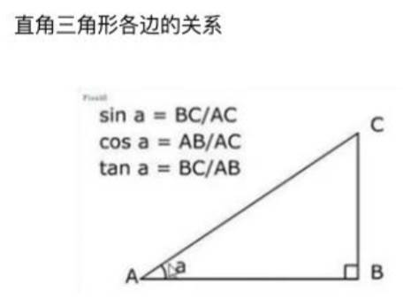

# Canvas 绘画状态-保存和恢复。

什么是 Canvas 绘画状态？

- 是当前绘画时所产生的样式和变形的一个快照。
- Canvas 在绘画时，会产生相应的绘画状态，其实我们是可以将某些绘画的状态存储在栈中来为以后复用。


Canvas 绘画状态要调用 `save` 和 `restore` 方法来保存和恢复，这两个方法都没有参数，并且它们是成对存在的。

- `save()`：保存画布 (canvas) 的所有绘画状态。
- `restore()`：恢复画布 (canvas) 的所有绘画状态。

Canvas 绘画状态包括：

- 当前应用的变形（即移动，旋转和缩放）
- 以及这些属性：
	- strokeStyle, fillStyle；
	- globalAlpha；
	- lineWidth, lineCap, lineJoin；
	- font, textAlign, textBaseline；
	- miterLimit, shadowOffsetX, shadowOffsetY, shadowBlur, shadowColor, ......
- 当前的裁切路径（clipping path）

02-Canvas\demo-project\05-Canvas绘画状态\02-保存和恢复绘画状态.html

```html
<!DOCTYPE html>
<html lang="en">
<head>
	<meta charset="UTF-8">
	<meta http-equiv="X-UA-Compatible" content="IE=edge">
	<meta name="viewport" content="width=device-width, initial-scale=1.0">
	<title>Document</title>
	<style>
		body {
			margin: 0;
			padding: 0;
			background-image: url(../images/grid.png);
		}
		canvas {
			background-color: rgba(255, 0, 0, .1);
		}
	</style>
</head>
<body>

	<canvas id="tutorial" width="300" height="300">
		您的浏览器不兼容 Canvas，请升级您的浏览器。
	</canvas>

	<script>
		window.onload = function() {
			const canvasEl = document.getElementById('tutorial')
			if (!canvasEl.getContext) return
			const ctx = canvasEl.getContext('2d')

			ctx.fillStyle = 'red'
			ctx.fillRect(10, 10, 30, 15)
			ctx.save()

			ctx.fillStyle = 'green'
			ctx.fillRect(50, 10, 30, 15)
			ctx.save()

			ctx.fillStyle = 'blue'
			ctx.fillRect(90, 10, 30, 15)
			ctx.save()

			ctx.restore() // 取出 ctx.fillStyle = 'blue' 的状态
			ctx.fillRect(90, 40, 30, 80)

			ctx.restore() // 取出 ctx.fillStyle = 'green' 的状态
			ctx.fillRect(50, 40, 30, 80)

			ctx.restore() // 取出 ctx.fillStyle = 'red' 的状态
			ctx.fillRect(10, 40, 30, 80)
		}
	</script>
</body>
</html>
```

# Canvas 形变

Canvas 和 CSS3 一样也支持变形；可以将坐标进行移动、旋转和缩放。

Canvas 的形变有4种方法实现：
- `translate(x, y)`：用来移动 canvas 和它的原点到一个不同的位置。
	- x 是左右偏移量，y 是上下偏移量（无需要单位）。
- `rotate(angle)`：用于以原点为中心旋转 canvas，即沿着 z 轴旋转。
	- angle 是旋转的弧度，是顺时针方向，以弧度为单位。
- `scale(x, y)`：用来增减图形在 canvas 中像素数目，对图形进行缩小或放大。
	- x 为水平缩放因子，y 为垂直缩放因子。如果比 1 小，会缩小图形，如果比 1 大会放大图形。默认值为 1，也支持负数。
- `transform(a, b, c, d, e, f)`：允许对变形矩阵直接修改。这个方法是将当前的变形矩阵乘上一个基于自身参数的矩阵。

注意事项：
- 在做变形之前先调用 `save` 方法保存状态是一个良好的习惯。
- 大多数情况下，调用 `restore` 方法比手动恢复原先的状态要简单得多。
- 如果在一个循环中做位移但没有保存和恢复 canvas 状态，很可能到最后会发现有些东西不见了，因为它很可能已超出 canvas 画布以外了。
- 形变需要在绘制图形前调用。

## Canvas 的移动

translate 方法，它用来移动 canvas 和它的原点到一个不同的位置。

- `translate(x, y)`：x 是左右偏移量，y 是上下偏移量（无需单位）。

translate 方法可让我们任意放置图形，而不需要手工一个个调整坐标值。

比如要移动一个矩形的位置，可以这么做：

1. 先保存一下 canvas 当前的状态；
2. 在绘制图形前 translate 移动画布；
3. 开始绘制图形，并填充颜色。

02-Canvas\demo-project\06-Canvas的形变\01-形变-translate.html

```js
window.onload = function() {
	const canvasEl = document.getElementById('tutorial')
	if (!canvasEl.getContext) return
	const ctx = canvasEl.getContext('2d')

	ctx.save()
	ctx.translate(100, 100)
	ctx.fillRect(0, 0, 100, 50)
	ctx.restore()

	ctx.save()
	ctx.translate(150, 150)
	ctx.fillStyle = 'red'
	ctx.fillRect(0, 0, 50, 30)
	ctx.restore()
}
```

## Canvas 的旋转

rotate 方法，它用于以原点为中心旋转 canvas，即沿着 z 轴 旋转。

`rotate(angle)`：只接受一个参数：旋转的弧度 (angle)，它是顺时针方向，

旋转的中心点始终是 canvas 的原坐标点，如果要移动它，我们还是要用到 `translate` 方法。

旋转案例：

1. 先保存一下 Canvas 当前的状态，并确定旋转原点。
2. 在绘制图形前旋转画布（坐标系会跟着旋转了）。
3. 开始绘制图形，并填充颜色

02-Canvas\demo-project\06-Canvas的形变\02-形变-rotate.html

```js
window.onload = function() {
	const canvasEl = document.getElementById('tutorial')
	if (!canvasEl.getContext) return
	const ctx = canvasEl.getContext('2d')

	ctx.save()
	ctx.translate(100, 100)
	ctx.rotate(Math.PI / 180 * 45) // 旋转 45°
	ctx.fillRect(0, 0, 50, 50)
	ctx.restore()

	ctx.save()
	ctx.translate(150, 150)
	ctx.fillStyle = 'red'
	ctx.fillRect(0, 0, 50, 30)
	ctx.restore()
}
```

## Canvas 的缩放

scale 方法可以缩放画布。可用它来增减图形在 canvas 中的像素数目，对图形进行缩小或者放大。

- `scale(x, y)`：x 为水平缩放因子，y 为垂直缩放因子，也支持负数；如果比 1 小，会缩小图形，如果比 1 大会放大图形。默认值为 1。

注意事项：

- 画布初始情况下，是以左上角坐标为原点。如果参数为负实数，相当于以 x 或 y 轴作为对称轴镜像反转。
	- 例如，使用 `translate(0, canvas.height)`; `scale(1,-1)`; 以 x 轴作为对称轴镜像反转。
- 默认情况下，canvas 的 1 个单位为 1 个像素。
  - 如果我们设置缩放因子是 0.5，1 个单位就变成对应 0.5 个像素，这样绘制出来的形状就会是原先的一半。
  - 同理，设置为 2.0 时，1 个单位就对应变成了 2 像素，绘制的结果就是图形放大了 2 倍。

缩放案例：

1. 先保存一下 Canvas 当前的状态，并确定缩放原点；
2. 在绘制图形前缩放画布；
3. 开始绘制图形，并填充颜色。

02-Canvas\demo-project\06-Canvas的形变\02-形变-scale.html

```js
window.onload = function() {
	const canvasEl = document.getElementById('tutorial')
	if (!canvasEl.getContext) return
	const ctx = canvasEl.getContext('2d')

	ctx.save()
	ctx.translate(0, 300)
	ctx.scale(1, -1)
	ctx.translate(50, 0)
	ctx.fillRect(0, 0, 50, 50)
	ctx.restore()
}
```

# Canvas 动画


Canvas 绘图都是通过 JavaScript 去操控的，如要实现一些交互性动画是相当容易的。那 Canvas 是如何做一些基本动画的？
- canvas 可能最大的限制就是图像一旦绘制出来，就不会改变。
- 如需要执行动画，不得不对画布上所有图形进行一帧一帧的重绘（比如在1秒绘60帧就可绘出流畅的动画了）。
- 为了实现动画，我们需要一些可以定时执行重绘的方法。然而在 Canvas 中有三种方法可以实现：分别为 `setInterval`、`setTimeout` 和 `requestAnimationFrame` 三种方法来定期执行指定函数进行重绘。

Canvas 画出一帧动画的基本步骤（如要画出流畅动画，1s 需绘 60 帧）：
1. 用 clearRect 方法清空 canvas ，除非接下来要画的内容会完全充满 canvas（例如背景图），否则你需要清空所有。
2. 保存 canvas 状态，如果加了 canvas 状态的设置（样式，变形之类的），又想在每画一帧之时都是原始状态的话， 你需要先保存一下，后面再恢复原始状态。
3. 绘制动画图形（animated shapes） ，即绘制动画中的一帧。
4. 恢复 canvas 状态，如果已经保存了 canvas 的状态，先恢复它，然后重绘下一帧。

## 绘制秒针案例

### 使用 setInterval 绘制；

步骤：

1. 用 clearRect(x,y,w,h) 方法，清空 canvas 。
2. 保存 canvas 状态 。
3. 修改 canvas 状态 （样式、移动坐标、旋转等）。
4. 绘制秒针图形（即绘制动画中的一帧）。
5. 恢复 canvas 状态 ，准备重绘下一帧。

```js
window.onload = function() {
	const canvasEl = document.getElementById('tutorial')
	if (!canvasEl.getContext) return
	const ctx = canvasEl.getContext('2d')

	let count = 0
	function draw() {
		if (count++ >= 60) count = 0
		ctx.clearRect(0, 0, 300, 300)
		ctx.save()

		// 1.开始绘画
		ctx.translate(100, 100)
		ctx.rotate(Math.PI * 2 / 60 * count)

		ctx.lineWidth = 6
		ctx.lineCap = 'round'
		ctx.strokeStyle = 'red'

		ctx.beginPath()
		ctx.moveTo(0, 0)
		ctx.lineTo(0, -80)
		ctx.stroke()
		ctx.restore()
	}
	draw()
	setInterval(() => {
		draw()
	}, 1000);
}
```

setInterval 定时器的缺陷

- setInterval 定时器不是非常精准的，因为 setInterval 的回调函数是放到了宏任务中等待执行。
- 如果微任务中一直有未处理完成的任务，那么 setInterval 的回调函数就有可能不会在指定时间内触发回调。
- 如果想要更加平稳和更加精准的定时执行某个任务的话，就要使用 `requestAnimationFrame` 函数。

### 使用 requestAnimationFrame

`requestAnimationFrame` 函数：

- 告诉浏览器——你希望执行一个动画，并且要求浏览器在下次重绘之前调用该函数的回调函数来更新动画。
- 该方法需要传入一个回调函数作为参数，该回调函数会在浏览器下一次重绘之前执行
- 若想在浏览器下次重绘之前继续更新下一帧动画，那么在回调函数自身内必须再次调用 `requestAnimationFrame()`
- 通常每秒钟回调函数执行 60 次左右，也有可能会被降低。

02-Canvas\demo-project\07-Canvas的动画\02-requestAnimationFrame初体验.html

```js
window.onload = function() {
	const canvasEl = document.getElementById('tutorial')
	if (!canvasEl.getContext) return
	const ctx = canvasEl.getContext('2d')

	let count = 0
	function draw() {
		const second = new Date().getSeconds()
		ctx.clearRect(0, 0, 300, 300)
		ctx.save()

		// 1.开始绘画
		ctx.translate(100, 100)
		ctx.rotate(Math.PI * 2 / 60 * second)

		ctx.lineWidth = 6
		ctx.lineCap = 'round'
		ctx.strokeStyle = 'red'

		ctx.beginPath()
		ctx.moveTo(0, 0)
		ctx.lineTo(0, -80)
		ctx.stroke()

		ctx.restore()
		requestAnimationFrame(draw)
	}
	requestAnimationFrame(draw)
}
```

# 绘制太阳系旋转案例

步骤：

1. 用 `clearRect(x,y,w,h)` 方法，清空 canvas ，并初始化全局样式。
2. 保存 canvas 状态 。
3. 绘制背景、绘制地球（绘制月球）、绘制阴影效果。
4. 恢复 canvas 状态 ，准备重绘下一帧。

02-Canvas\demo-project\08-Canvas的动画案例\01-太阳系动画效果.html

```js
window.onload = function() {
	const canvasEl = document.getElementById('tutorial')
	if (!canvasEl.getContext) return
	const ctx = canvasEl.getContext('2d')

	const sun = new Image()
	sun.src = '../images/canvas_sun.png'

	const earth = new Image()
	earth.src = '../images/canvas_earth.png'

	const moon = new Image()
	moon.src = '../images/canvas_moon.png'


	function draw() {
		console.log('draw')
		ctx.clearRect(0, 0, 300, 300)
		drawBg()
		drawEarth()
		requestAnimationFrame(draw)
	}
	requestAnimationFrame(draw)

	// ----------------封装的代码-----------------

	function drawBg() {
		// 绘制太阳背景图片&地球公转轨迹
		ctx.save()
		ctx.drawImage(sun, 0, 0)
		ctx.translate(150, 150)
		ctx.strokeStyle = 'rgba(0, 153, 255, 0.4)'
		ctx.beginPath()
		ctx.arc(0, 0, 105, 0, Math.PI * 2)
		ctx.stroke()
		ctx.restore()
	}

	function drawEarth() {
		// 绘制地球
		const time = new Date()
		const second = time.getSeconds()
		const milliseconds = time.getMilliseconds()
    
		ctx.save()
		ctx.translate(150, 150)
		ctx.rotate(
      Math.PI * 2 / 60 * second +
      Math.PI * 2 / 60 / 1000 * milliseconds
    )
		ctx.translate(105, 0)
		ctx.drawImage(earth, -12, -12)
		drawMoon(second, milliseconds)
		drawEarthMask()
		ctx.restore() // 地球 end
	}

	function drawMoon(second, milliseconds) {
		// 绘制月球
		ctx.save()
		ctx.rotate(
      Math.PI * 2 / 10 * second +
      Math.PI * 2 / 10 / 1000 * milliseconds
    )
		ctx.translate(0, 20)
		ctx.drawImage(moon, -3.5, -3.5)
		ctx.restore() // 月球 end
	}

	function drawEarthMask() {
		// 绘制地球的蒙版
		ctx.save()
		ctx.fillStyle = 'rgba(0, 0, 0, .4)'
		ctx.fillRect(0, -12, 40, 24)
		ctx.restore() // 蒙版 end
	}
}
```
# 绘制时钟案例

求圆上 x, y 的坐标：

- 圆上 x, y 轴坐标实际上就是下图的 ( AB, BC )，AC 为时钟半径
- x = AB = cosa * AC => x = Math.cos(弧度) * R
- y = BC = sina * AC => y = Math.sin(弧度) * R
- 第 i 小时的坐标： 
	- x = Math.cos( Math.PI * 2 / 12 * i ) * R 
	- y = Math.sin( Math.PI * 2 / 12 * i ) * R



绘制时钟，绘制一帧的步骤：

1. 用 `clearRect(x,y,w,h)` 方法，清空 canvas 。
2. 保存 canvas 状态。
3. 绘制白背景、绘制数字、绘制时/分/秒针、绘制圆、绘制时分刻度。
4. 恢复 canvas 状态，准备重绘下一帧。

02-Canvas\demo-project\08-Canvas的动画案例\02-绘制时钟动画.html
