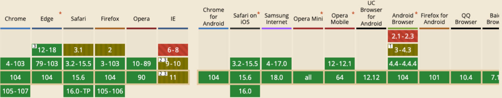
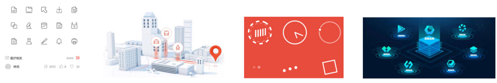
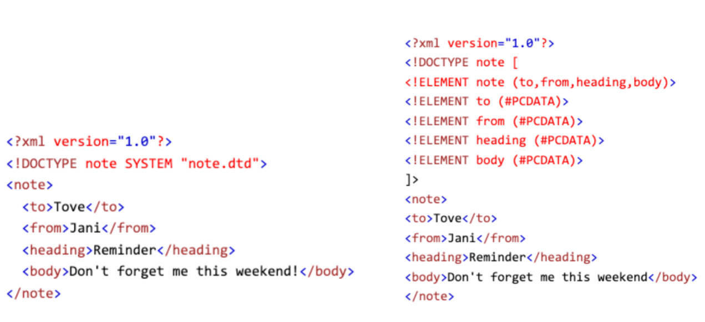
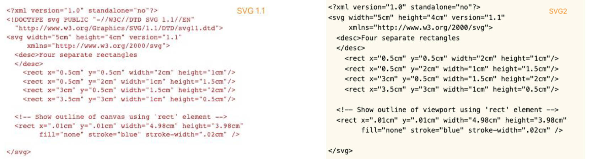
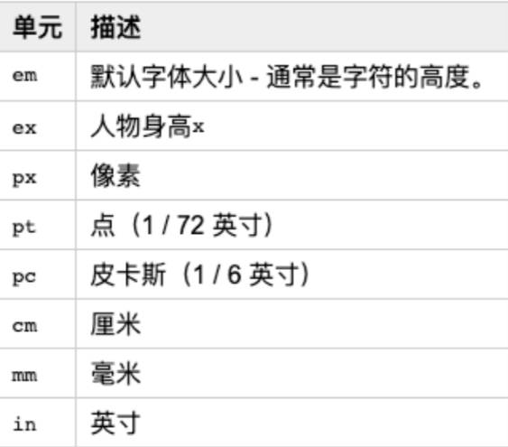
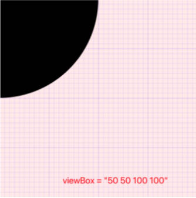
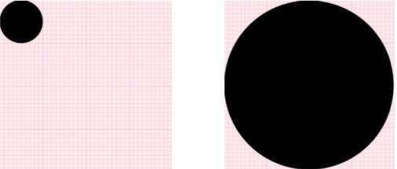
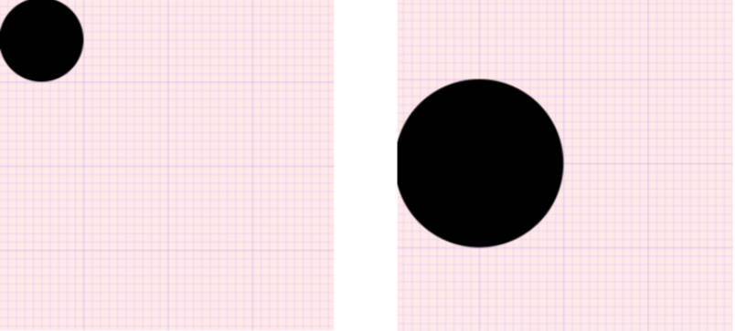
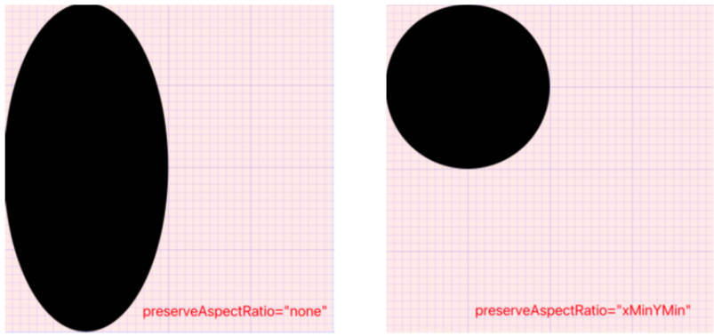

# 邂逅 SVG

什么是 SVG？

- SVG 全称为（Scalable Vector Graphics），即可缩放矢量图形。

  > 矢量定义：既有大小又有方向的量。
  >
  > - 在物理学中称作矢量，如一个带箭头线段：长度表示大小，箭头表示方向；
  > - 在数学中称作向量。在计算机中，矢量图可无限放大而不变形。

- SVG 规范是万维网联盟(W3C)自1998年以来开发的标准。
- SVG 是一种基于 XML 格式的矢量图，主要用于定义二维图形，支持交互和动画。
- SVG 图像可在不损失质量的情况下按比例缩放，并支持压缩。
- 基于 XML 的 SVG 可轻松的用文本编辑器或矢量图形编辑器创建和编辑，并可以直接在浏览器显示。


SVG 的兼容性：




# SVG 的发展历史

SVG1.x 版本
- SVG 是 W3C SVG 工作组于1998年开始开发，而 SVG1.0 于2001年9月4日成为 W3C 推荐的标准。
- SVG1.1 于 2003年1月14日成为 W3C 推荐的标准。该版本增加了模块化规范的内容。除此之外，1.1和1.0几乎没有区别。
- SVG Tiny 1.2 于2008年12月22日成为 W3C 推荐标准，主要是为性能低的小设备生成图形，但是后来被 SVG2.0 所弃用了。
- SVG1.1 第二版于2011年8月16日发布，这次只是更新了勘误表和说明，并没有增加新功能 。

SVG2.0 版本（推荐）
- SVG2.0 于2016年9月15日成为 W3C 候选推荐标准，最新草案于2020年5月26日发布。
- SVG2.x Change From SVG1.x (https://www.w3.org/TR/SVG/changes.html)，比如：
	- Removed the `baseProfile` and `version` attributes from the `<svg>` element.
	- Added the ability to use `auto` for the `width` and `height` attributes on `<image>`.
	- Added `lang` attribute on `<desc>` and `<title>` elements.
	- Removed the `xlink:type`, `xlink:role`, `xlink:arcrole`, `xlink:show` and `xlink:actuate` attributes（“xlink”为命名空间的前缀）.
	- Deprecated the `xlink:href` attribute in favor of using ‘href’ without a namespace.


# SVG 的优点和缺点

SVG 的优点：

- 【扩展好】：矢量图像在浏览器中放大缩小不会失真，可在许多设备和浏览器中使用。而光栅图像（PNG、JPG）放大缩小会失真。
  > 矢量图像是基于矢量的点、线、形状和数学公式来构建的图形，该图形是没有像素的，放大缩小是不会失真的。
  >
  > 光栅图像是由像素点构建的图像——微小的彩色方块，大量像素点可以形成高清图像，比如照片。图像像素越多，质量越高。
- 【灵活】：SVG 是 W3C 开发的标准，可结合其它的语言和技术一起使用，包括 CSS、JavaScript、HTML 和 SMIL 。SVG 图像可以直接使用 JS 和 CSS 进行操作，使用时非常方便和灵活，因为 SVG 也是可集成到 DOM 中的。
- 【可以动画】：SVG 图像可以使用 JS、CSS 和 SMIL 进行动画处理。对于 Web 开发人员来说非常的友好。
- 【轻量级】：与其它格式相比，SVG 图像的尺寸非常小。根据图像的不同，PNG 图像质量可能是 SVG 图像的 50 倍。
- 【可打印】：SVG 图像可以以任何分辨率打印，而不会损失图像质量。
- 【利于SEO】：SVG 图像被搜索引擎索引。因此，SVG 图像非常适合 SEO（搜索引擎优化）目的。
- 【可压缩】：与其它图像格式一样，SVG 文件支持压缩。
- 【易于编辑】：只需一个文本编辑器就可以创建 SVG 图像。设计师通常会使用 Adobe Illustrator（AI）等矢量图形工具创建和编辑。在 Vue 或 React 中可以方便地将 SVG 图片，转成 SVG 组件。

SVG 的缺点：

- 不适合高清图片制作：

   - SVG 格式非常适合用于徽标和图标（ICON）等 2D 图形，但不适用于高清图片，不适合进行像素级操作。
   - SVG 的图像无法显示与标准图像格式一样多的细节，因为它们是使用点和路径而不是像素来渲染的。

- SVG 图像变得复杂时，加载会比较慢；
- 不完全扩平台：

	- 尽管 SVG 自 1998 年以来就已经存在，并得到了大多数现代浏览器（桌面和移动设备）的支持，但它不适用于 IE8 及更低版本的旧版浏览器。根据 caniuse 的数据，大约还有 5% 的用户在使用不支持 SVG 的浏览器。


# SVG 有哪些应用场景

下面是一些保证 SVG 优于其他图像格式的应用场景：

- SVG 非常适合显示矢量徽标（Logo）、图标（ICON）和其他几何设计。
- SVG 适合应用在需适配多种尺寸的屏幕上展示，因为 SVG 的扩展性更好。
- 当需要创建简单的动画时，SVG 是一种理想的格式。
   - SVG 可以与 JS 交互来制作线条动画、过渡和其他复杂的动画。
  - SVG 可以与 CSS 动画交互，也可以使用自己内置的 SMIL 动画。
- SVG 也非常适合制作各种图表（条形图、折线图、饼图、散点图等等），以及大屏可视化页面开发。




# SVG 和 Canvas 的区别

可扩展性：
- SVG 是基于矢量的点、线、形状和数学公式来构建的图形，该图形是没有像素的，放大缩小不会失真。Canvas 是由一个个像素点构成的图形，放大会使图形变得颗粒状和像素化（模糊）。
- SVG 可以在任何分辨率下高质量的打印。Canvas 不适合在任意分辨率下打印。

渲染能力：
- 当 SVG 很复杂时，它的渲染就会变得很慢，因为在很大程度上去使用了 DOM，Canvas 提供了高性能的渲染和更快的图形处理能力，例如：适合制作 H5 小游戏。
- 当图像中具有大量元素时，SVG 文件的大小会增长得更快（导致 DOM 变得复杂），而 Canvas 并不会增加太多。

灵活度：
- SVG 可以通过 JavaScript 和 CSS 进行修改，用 SVG 来创建动画和制作特效非常方便。Canvas 只能通过 JavaScript 进行修改，创建动画得一帧帧重绘。

使用场景：
- SVG 非常适合显示矢量徽标（Logo）、图标（ICON）和其他几何设计。
- Canvas 主要用于游戏开发、绘制图形、复杂照片的合成，以及对图片进行像素级别的操作，如：取色器、复古照片。

# 创建 SVG 矢量图方式

四种方式：

- 方式一：在一个单独的 svg 文件中绘制，该文件可直接在浏览器预览或嵌入到 HTML 中使用（推荐）；
- 方式二：直接在 HTML 文件中使用 svg 元素来绘制（推荐）；
- 方式三：直接使用 JavaScript 代码来生成 svg 矢量图；
- 方式四：使用 AI（Adobe IIIustractor）矢量绘图工具来绘制矢量图，并导出为 svg 文件（推荐）。

## 方式一：在单独的 svg 文件中绘制

4个步骤：

1. 新建一个 svg 文件，在文件第一行编写 XML 文件声明；
2. 编写一个 `<svg>` 元素，并给该元素添加如下属性：

	- `version`：指定使用 svg 的版本，值为 1.0 和 1.1，并没有 2.0。
	- `baseProfile`：SVG2.0 之前，version 和 baseProfile 属性用来验证和识别 SVG 版本。而 **SVG2.0 后不推荐使用这两个属性了**。
	- `width / height`：指定 svg 画布（视口）的宽和高，默认值分别为 300 和 150，默认使用 px 单位。
	- `xmlns`：给 svg 元素绑定一个命名空间（http://www.w3.org/2000/svg） 意味着这个 `<svg>` 标签和它的子元素都属于该命名空间下。
3. 在 `<svg>` 元素中添加图形（比如：`<rect>`）元素
4. 在浏览器直接预览或嵌入到 HTML 中预览。
   - 嵌入 HTML 有6种方案。

### svg 文件中的 XML 声明和 DTD 声明：

- 由于 SVG 文件是一个 XML 文件格式，在编写 XML 文档时，通常是推荐编写 XML 声明的。

   - 在 XML1.0 中，XML 声明是可选的，推荐写但不强制。
   - 在 XML1.1 中，声明是强制性的，如果没有声明，则自动暗示该文档是 XML1.0 文档。所以建议在编写 SVG 文件时也编写一个 XML 声明。

- SVG 的 XML 声明格式：
  
  ```xml
  <?xml version="1.1" encoding="UTF-8" standalone="no" ?>
  ```
  
  - `version` 指定版本（必填）；
  - `encoding` 指定 XML 文档的编码（可选，默认是 UTF-8）；
  - `standalone`：指定当前 XML 文档是否依赖于外部标记声明（可选，和 DTD 声明一起用才有意义）。
     - 默认为 `no`：代表依赖外部标记声明；
     - `yes`：代表依赖内部默认的标记声明。
  
- SVG 的文档类型声明 DTD（Document Type Declare），用于解析器验证 XML 文件是否符合该规范，与 HTML5 文件的 DTD 声明类似。

   - XML 中内部 DTD 声明（可选）；

      

   - XML 中外部 DTD 声明（可选）

      ```xml
      <!DOCTYPE svg PUBLIC "-//W3C//DTD SVG 1.1//EN" "http://www.w3.org/Graphics/SVG/1.1/DTD/svg11.dtd">`
      ```

通过 svg 文件，创建 svg 矢量图

```xml
<?xml version="1.1" encoding="UTF-8" standalone="no" ?>
<!DOCTYPE svg PUBLIC "-//W3C//DTD SVG 1.1//EN" "http://www.w3.org/Graphics/SVG/1.1/DTD/svg11.dtd" >
<!--
	version="1.1"
	baseProfile="full" 正确渲染 svg 内容时所需要最小 SVG 语言概述(版本);
		* full: 正常的 SVG 语言概述；
		* basic: 基本 SVG 语言概述；
		* tiny: 轻量级 SVG 语言概述。
	xmlns: 指定 svg 元素和 svg 内的子元素都是属于 http://www.w3.org/2000/svg 这个命名空间下
-->
<svg
	version="1.1"
	baseProfile="full"
	width="100"
	height="100"
	xmlns="http://www.w3.org/2000/svg"
>
	<rect x="0" y="0" width="100" height="100"></rect>
	<title>我是 svg title</title>
</svg>
```

### SVG 文档解构

[SVG1.1 文档结构](https://www.w3.org/TR/SVG11/struct.html)

- 第一行：XML 声明。
- 第二行：DTD 声明.

[SVG2.0 文档结构](https://www.w3.org/TR/SVG2/struct.html#Namespace)

-  不推荐写 DTD 声明。
-  `<svg>` 标签上 `version` 和 `baseProfile` 属性已删除；
-  其中 `<desc>` 元素是用来描述该文件的。



使用 SVG2.0 文档结构重构上面代码：

```xml
<?xml version="1.1" standalone="no" ?>
<svg
 width="100"
 height="100"
 xmlns="http://www.w3.org/2000/svg"
>
  <rect x="0" y="0" width="100" height="100"></rect>
</svg>
```

## 方式二：在 HTML 文件中使用 svg 元素绘制

```html
<!DOCTYPE html>
<html lang="en">
<head>
  <meta charset="UTF-8">
  <meta http-equiv="X-UA-Compatible" content="IE=edge">
  <meta name="viewport" content="width=device-width, initial-scale=1.0">
  <title>Document</title>
</head>
<body>

  <!-- 1.创建svg 1.0 -->
  <svg
    version="1.0"
    baseProfile="full"
    width="100"
    height="100"
    xmlns="http://www.w3.org/2000/svg"
  >
   <rect x="0" y="0" width="100" height="100"></rect>
  </svg>

  <!-- 2.创建svg 2.0 -->
  <svg
    width="100"
    height="100"
    xmlns="http://www.w3.org/2000/svg"
  >
   <rect x="0" y="0" width="100" height="100"></rect>
  </svg>

    <!--
      3.创建 svg 2.0 简写
        * 默认：w：300px；h：150px
        * xmlns="http://www.w3.org/2000/svg" 这个命名空间浏览器的解析器会自动添加
    -->
  <svg>
    <rect x="0" y="0" width="100" height="100"></rect>
  </svg>
</body>
</html>
```

## 方式三：使用 JS 创建 svg

使用 JS 脚本来创建 SVG 时，创建的元素都是需要添加命名空间的。
- 比如：创建 `<svg>` 或者 `<rect>` 元素都需要添加命名空间`http://www.w3.org/2000/svg`
- 对于元素上的属性不带前缀的，命名空间就为 `null`。

因为在 XML1.1 命名空间规范中建议，不带前缀的属性（带前缀如 xlink:href）命名空间的名称是没有值的，这时命名空间的值必须使用 null 值。

创建 SVG 常用的 DOM2 API：
- `createElementNS(ns, elname)`：创建SVG元素；
- `setAttributeNS(ns, attrname, value)`：给SVG元素添加属性；
- `getAttributeNS(ns, attrname)`：获取SVG元素上的属性；
- `hasAttributeNS(ns, attrname)`： 判断SVG元素上是否存在某个属性；
- `removeAttributeNS(ns, attname)`：删除SVG元素上的某个属性；
- [更多的API](https://developer.mozilla.org/zh-CN/docs/Web/SVG/Namespaces_Crash_Course)

03-SVG\demo-project\01-创建SVG的方式\05-方式三-通过JS来创建SVG.html

```html
<!DOCTYPE html>
<html lang="en">
<head>
	<meta charset="UTF-8">
	<meta http-equiv="X-UA-Compatible" content="IE=edge">
	<meta name="viewport" content="width=device-width, initial-scale=1.0">
	<title>Document</title>
</head>
<body>

	<script>
		/**
		 * 使用 js 操作；
		 * svg 的框架 Snap.svg，类似于 jQuery。
		 */
		window.onload = function() {
			// 1.创建 svg 和 rect 元素
			const xmlns = 'http://www.w3.org/2000/svg'
			const svgEl = document.createElementNS(xmlns, 'svg')
			const rectEl = document.createElementNS(xmlns, 'rect')

			// 2.给 svg 和 rect 元素对象添加属性
			svgEl.setAttributeNS(null, 'version', '1.0')
			svgEl.setAttributeNS(null, 'width', 100)
			svgEl.setAttributeNS(null, 'height', 100)

			rectEl.setAttributeNS(null, 'width', 50)
			rectEl.setAttributeNS(null, 'height', 50)

			// 3.将 svg 添加到 body 上
			svgEl.appendChild(rectEl)
			document.body.appendChild(svgEl)
    }
	</script>
</body>
</html>
```

# 在 HTML 中引入 svg 的6种方式。

方式一：img 元素
- 作为一张图片使用，不支持交互，只兼容 ie9 以上。

```html

```

方式二：CSS 背景
- 作为一张背景图片使用，不支持交互。

```css
.box{
  width: 200px;
  height: 200px;
  background-image: url(./rect.svg);
  background-repeat: no-repeat;
}
```

方式三：直接在 HTML 文件引用源文件
- 作为 HTML 的 DOM 元素，支持交互，只兼容 ie9 以上。
- 见上方“在 HTML 中使用 svg 元素”。

方式四：object 元素（了解）。
- 支持交互式 svg，能拿到 object 的引用，为 SVG 设置动画、更改其样式表等。

```html
<object data="./svg/rect.svg" type="image/svg+xml"></object>
```

方式五：iframe 元素（了解） 。
- 支持交互式 svg，能拿到 iframe 的引用，为 SVG 设置动画、更改其样式表等

```html
<iframe src="./svg/rect.svg"></iframe>
```

方式六：embed 元素（了解） 。
- 支持交互式 svg，能拿到 embed 的引用，为 SVG 设置动画、更改其样式表等，对旧版浏览器有更好的支持。

```html
<embed src="./svg/rect.svg" type="image/svg+xml" />
```


# SVG 中的坐标系（Grid）

SVG 使用的坐标系统（网格系统）和 Canvas 的差不多。坐标系是以左上角 (0,0) 为坐标原点，被称为初始**视口坐标系**，坐标以像素为单位，x 轴正方向向右，y 轴正方向向下。

- `<svg>` 元素默认宽为 300px, 高为 150px。`<svg>` 元素默认被网格所覆盖。
- 通常来说网格中的一个单元相当于 svg 元素中的一像素。
- 基本上在 SVG 文档中的 1 个像素对应输出设备（比如显示屏）上的 1 个像素（除非缩放）。
- `<svg>` 的 transform 属性可以用来移动、旋转、缩放 SVG 中的某个元素，
  - 如 <svg> 中某个元素用了变形，**该元素内部会建立一个新的坐标系统，该元素默认后续所有变化都是基于新创建的坐标系统**。

03-SVG\demo-project\03-SVG坐标系\01-坐标系统.html

```html
<!DOCTYPE html>
<html lang="en">
<head>
  <meta charset="UTF-8">
  <meta http-equiv="X-UA-Compatible" content="IE=edge">
  <meta name="viewport" content="width=device-width, initial-scale=1.0">
  <title>Document</title>
  <style>
    body {
      margin: 0;
      padding: 0;
      background-image: url(../images/grid.png);
    }
    svg {
      background-color: rgba(255, 0, 0, 0.1);
    }
  </style>
</head>
<body>

  <svg width="300" height="300" xmlns="http://www.w3.org/2000/svg" >
    <rect x="10" y="10" width="100" height="100"></rect>
  </svg>

</body>
</html>
```

# SVG 坐标系单位

SVG 坐标系统，在没有明确指定单位时，默认以像素为单位。

```xml
<!-- 定义一个矩形，即从左上角开始，向右延展 100px，向下延展 100px，形成一个 100*100 大的矩形 -->
<rect x="0" y="0" width="100" height="100" />
```

当然我们也可以手动指明坐标系的单位，比如：

```xml
<svg width="15cm" height="300" xmlns="http://www.w3.org/2000/svg" >
  <rect x="10" y="10" width="100px" height="5cm"></rect>
</svg>
```




# SVG 中的视口 - viewport

视口是 SVG 可见的区域（也可以说是 SVG 画布大小）。

使用 `<svg>` 元素的 `width` 和 `height` 属性指定视口的大小。

一旦设置了 svg 元素的宽度和高度，浏览器就会建立初始**视口坐标系**和初始**用户坐标系**。

## 视口坐标系

视口坐标系是在视口上建立的坐标系，原点在视口左上角的点 (0, 0)，x 轴正向向右，y 轴正向下。

初始视口坐标系中的一个单位等于视口中的一个像素，该坐标系类似于 HTML 元素的坐标系。

## 用户坐标系

**用户坐标系**是建立在 SVG 视口上的坐标系。该坐标系最初与视口坐标系相同，它的原点位于视口的左上角。

使用 `viewBox` 属性，可以修改初始用户坐标系，使其不再与视口坐标系相同。

用户坐标系，也称为**当前坐标系**或**正在使用的用户空间**，后面绘图都是参照该坐标系。

> 为什么要有两个坐标系？
>
> - 因为 SVG 是矢量图，支持任意缩放。在用户坐标系绘制的图形，最终会参照视口坐标系来进行等比例缩放。

03-SVG\demo-project\04-viewport和viewBox\02-viewport和viewBox有相同的宽高比.html

```xml
<svg width="400" height="400" viewBox="0 0 100 100" >
  <circle cx="50" cy="50" r="50"></circle>
</svg>
```

# svg 上的 viewBox 属性

`viewBox` 称为视图框，viewport 是 SVG 画布的大小，而 `viewBox` 是用来定义用户坐标系中的位置和尺寸的（该区域通常会被缩放来填充视口）。

- SVG 的图形都是绘制在用户坐标系中。用户坐标系可以比视口坐标系更小或更大，也可以在视口内完全或部分可见。
- 一旦创建了视口坐标系（即 `<svg>` 使用 `width` 和 `height`），浏览器就会创建一个与其相同的用户坐标系。
- 我们可以使用 viewBox 属性指定用户坐标系的大小。
  - 如果用户坐标系与视口坐标系具有**相同的高宽比**，它将 viewBox 区域拉伸以填充视口区域。
  - 如果用户坐标系和视口坐标系**没有相同的宽高比**，可用 `preserveAspectRatio` 属性来指定整个用户坐标系是否在视口内可见。

`viewBox` 的语法：

- viewBox = “<min-x> <min-y> <width> <height>”，比如：viewBox =“0 0 100 100”

- <min-x> <min-y> 确定视图框的左上角坐标（即视图框可见的区域，不是修改用户坐标系的原点，绘图还是从原来的 (0, 0) 开始）.

  

- <width> <height> 确定该视图框的宽度和高度。
  - 宽度和高度为 0 是禁用元素的显示；
  - 宽度和高度负值无效。

## 用户坐标系与视口坐标系相同宽高比的情况

等比例缩放：

```xml
<svg width="400" height="400" viewBox="0 0 100 100" >
  <circle cx="50" cy="50" r="50"></circle>
</svg>
```



## 用户坐标系与视口坐标系不同宽高比的情况

保留视图框 viewBox 的宽高比，但视图框 viewBox 不会拉伸以覆盖整个视口区域。

视图框 viewBox 在视口内垂直和水平居中。

03-SVG\demo-project\04-viewport和viewBox\04-viewport和viewBox不同的宽高比.html

```xml
<svg width="400" height="400"
  viewBox="0 0 200 100"
>
  <circle cx="50" cy="50" r="50"></circle>
</svg>
```



想改变视口内的视框位置怎么办？给 `<svg>` 添加 `preserveAspectRatio` 属性，该属性允许强制统一缩放视图框 viewBox

- `preserveAspectRatio= "none"`, 强制拉伸图形以填充整个视口。
- `preserveAspectRatio= “xMinYMin”`, 图形在视口的最小 x 和 y 轴上显示。

```xml
<svg width="400" height="400"
    viewBox="0 0 200 100"
    preserveAspectRatio="xMinYMin"
  >
  <circle cx="50" cy="50" r="50"></circle>
</svg>
```



# 使用 SVG 绘制矩形

使用 `<rect>` 元素绘制矩形，其中有6个基本属性：

- `x`： 矩形左上角的 x 轴位置；
- `y`： 矩形左上角的 y 轴位置；
- `width`： 矩形的宽度；
- `height`： 矩形的高度；
- `rx`： 圆角的 x 轴方位的半径；
- `ry`： 圆角的 y 轴方位的半径。

03-SVG\demo-project\05-SVG基本图形\01-绘制-矩形.html

```xml
<svg width="300" height="300" xmlns="http://www.w3.org/2000/svg" >
  <rect x="0" y="0" width="100" height="50"></rect>
  <rect x="100" y="100" width="100" height="50" rx="20" ry="20"></rect>
</svg>
```