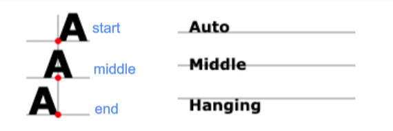

# SVG 可绘制哪些基本形状

在 SVG 画布中，如果要想插入一个形状，可以在文档中创建一个对应的元素。

并且可以使用不同的属性，来定义图形的大小和位置。

SVG 所支持的基本形状有：矩形、圆形、椭圆、线条、折线、多边形、路径。

# SVG 绘制圆形

用 SVG 绘制一个圆形，使用 <circle> 元素，3个基本属性：

- `r`：圆的半径；
- `cx`：圆心的 x 轴位置；
- `cy`：圆心的 y 轴位置；

03-SVG\demo-project\05-SVG基本图形\02-绘制-圆形.html

```xml
<svg width="300" height="300" xmlns="http://www.w3.org/2000/svg">
	<circle cx="100" cy="100" r="50" fill="red"><circle>
</svg>
```

# SVG 绘制椭圆

用 SVG 来绘制一个椭圆，使用 <ellipse> 元素

- <ellipse> 元素是 <circle> 元素更通用的形式，它可以分别缩放圆的 x 半径和 y 半径（长轴半径和短轴半径）。

<ellipse> 元素4个基本属性。

- `cx`：椭圆中心的 x 轴位置
- `cy`：椭圆中心的 y 轴位置
- `rx`：椭圆的 x 轴半径
- `ry`：椭圆的 y 轴半径

03-SVG\demo-project\05-SVG基本图形\03-绘制-椭圆.html

```xml
<svg width="300" height="300" xmlns="http://www.w3.org/2000/svg">
	<ellipse cx="100" cy="100" rx="25" ry="50" fill="red"></ellipse>
</svg>
```

# SVG 绘制线条

用 SVG 绘制一条直线，使用 <line> 元素。

- 它有两个点的位置作为属性，指定这条线的起点和终点。
- 需描边（而不是填充）才能显示。

<line> 元素有4个基本属：

- `x1`：起点的 x 轴位置；
- `y1`：起点的 y 轴位置；
- `x2`：终点的 x 轴位置；
- `y2`：终点的 y 轴位置。

03-SVG\demo-project\05-SVG基本图形\04-绘制-直线.html

```xml
<svg width="300" height="300" xmlns="http://www.w3.org/2000/svg">
	<line x1="100" y1="100" x2="200" y2="100" stroke="red" stroke-width="5"></line>
</svg>
```

# SVG 绘制折线（多段线）

用 SVG 绘制一条折线，使用 <polyline> 元素

- 一组连接在一起的直线。可以有很多的点，
- 默认会填充黑色。

折线的所有点位置都放在一个 `points` 属性。

- 点集数列。每个数字用空白、逗号、终止命令符或者换行符分隔开。
- 每个点必须包含 2 个数字，一个是 x 坐标，一个是 y 坐标。
- 所以点列表 (0,0), (1,1) 和 (2,2) 可以写成这样：“0 0, 1 1, 2 2”（推荐写法） 或 “0,0,1,1,2,2” 或 “0 0 1 1 2 2”

03-SVG\demo-project\05-SVG基本图形\05-绘制-折线.html

```xml
<svg width="300" height="300" xmlns="http://www.w3.org/2000/svg">
	<!-- 写法一 -->
	<polyline points="20 0, 80 50, 20 100" fill="transparent" stroke="red"></polyline>
	<!-- 写法二 -->
	<polyline points="20 10 80 60 20 110" fill="transparent" stroke="green"></polyline>
	<!-- 写法三 -->
	<polyline points="20, 20, 80, 70, 20, 120" fill="transparent" stroke="blue"></polyline>
</svg>
```

# SVG 绘制多边形

用 SVG 来绘制多边形,使用 <polygon> 元素

- 与折线很像，都是由连接一组点的直线构成。不同的是，<polygon> 的路径在最后一个点处自动闭合（矩形也是一种多边形，也可以用多边形创建）。
- 默认会填充黑色。

与折线一样，多边形有一个 `points` 属性。

- 点集数列。每个数字用空白符、逗号、终止命令或者换行符分隔开。
- 每个点必须包含 2 个数字，一个是 x 坐标，一个是 y 坐标。
- 所以点列表 (0,0), (1,1) 和 (2,2) 推荐写成这样：“0 0, 1 1, 2 2”。
- 路径绘制完后闭合图形，所以最终的直线将从位置 (2,2) 连接到位置 (0,0)。

03-SVG\demo-project\05-SVG基本图形\06-绘制-多边形.html

```xml
<svg width="300" height="300" xmlns="http://www.w3.org/2000/svg">
	<polygon points="20 0, 80 50, 20 100" fill="transparent" stroke="red"></polygon>
</svg>
```

# SVG 绘制路径

用 SVG 来绘制路径，使用 <path> 元素。

- SVG 中最常见的绘制方式。你可以用 <path> 元素绘制矩形（直角矩形或圆角矩形）、圆形、椭圆、折线形、多边形，以及一些其他的形状，例如贝塞尔曲线、2次曲线等曲线。
- 默认会填充黑色。
- 默认路径不会闭合。

路径有1个基本属性 `d` 用来基于用户坐标系设置路径点的位置。

- `d`：一个点集数列，采用命令+参数的序列，必须以 `M` 命令开头。
- 所以点列表 (0,0), (1,1) 和 (2,2) 推荐写成这样：`M 0 0, 1 1, 2 2`。
- 支持格式： “`M 0 0, 1 1, 2 2`” 或 “`M 0，0, 1, 1, 2，2`” 或 “`M 0 0 1 1 2 2`”

03-SVG\demo-project\05-SVG基本图形\07-绘制-路径.html

```xml
<svg width="300" height="300" xmlns="http://www.w3.org/2000/svg">
	<!-- 使用 path 绘制一个三角新折线 -->
	<path d="M 20 0, 80 50, 20 100" fill="transparent" stroke="red"></path>
	<!-- 使用 path 绘制一个闭合的三角形 -->
	<path d="M 70, 0, 130, 50, 70, 100 Z" fill="transparent" stroke="red"></path>
	<!--
		使用 path 绘制命令
			M：MoveTo
			Z：close path
			L：Line To，可省略
	-->
	<path d="M 120 0, L 180 50, L 120 100 Z" fill="transparent" stroke="red"></path>
</svg>
```
## 命令

命令是大小写敏感的，

- 大写字母，表示采用绝对定位。另一种是用小写字母，表示采用相对定位。

03-SVG\demo-project\05-SVG基本图形\08-绘制-路径-命令.html

```xml
<svg width="300" height="300" xmlns="http://www.w3.org/2000/svg">
	<path d="M 20 0, L 80 50, l 20 50 Z" fill="transparent" stroke="red"></path>
</svg>
```

有哪些命令？

- 直线命令：
	- `M` / `m`：Move To
	- `L` / `l`：Line To
	- `Z` / `z`：Close Path
	- `H` / `h`：horizontal
	- `V` / `v`：vertical
- 曲线命令
	- `C`：三次贝塞尔曲线
	- `S`：简写三次贝塞尔曲线
	- `Q`：二次贝塞尔曲线
	- `T`：简写二次贝塞尔曲线

# SVG 绘制图片

用 SVG 来绘制图片，使用 <image> 元素，

- 在元素的 `href` 属性引入图片 URL（不是 `src`）[href 属性兼容性](https://developer.mozilla.org/en-US/docs/Web/SVG/Attribute/href#browser_compatibility)。
- 元素的 `x`,`y` 属性，坐标定位，默认值为 0。
- 元素的 `height`、`width` 属性，默认为图片大小。如果为 0，将不会呈现这个图像。

03-SVG\demo-project\06-SVG绘制图片和文字\01-绘制-图片.html

```xml
<!-- svg 2.0 -->
<svg
	width="300"
	height="300"
	xmlns="http://www.w3.org/2000/svg">
	<image
		x="0"
		y="0"
		href="../images/googlelogo_color_92x30dp.png"
		width="100"
		height="100">
	</image>
</svg>
<!-- svg 1.0 -->
<svg
	version="1.0"
	baseProfile="full"
	width="300"
	height="300"
	xmlns="http://www.w3.org/2000/svg"
	xmlns:xlink="http://www.w3.org/1999/xlink">
	<image
		x="0"
		y="0"
		xlink:href="../images/googlelogo_color_92x30dp.png"
		width="100"
		height="100">
	</image>
</svg>
<!-- svg 2.0 兼容 svg 1.0 -->
<svg
	version="1.0"
	baseProfile="full"
	width="300"
	height="300"
	xmlns="http://www.w3.org/2000/svg"
	xmlns:xlink="http://www.w3.org/1999/xlink">
	<image
		x="0"
		y="0"
		xlink:href="../images/googlelogo_color_92x30dp.png"
		href="../images/googlelogo_color_92x30dp.png"
		width="100"
		height="100">
	</image>
</svg>
```

# SVG 绘制文本

用 SVG 来绘制文字，使用 <text> 元素。

<text> 元素的基本属性：

- `x` 和 `y` 属性决定了文本在用户坐标系中显示的位置。

- `text-anchor` 文本流方向属性，可以有 `start`、`middle`、`end` 或 `inherit` 值，默认值 `start`。

- `dominant-baseline` 基线对齐属性 : 有 `auto` 、`middle` 或 `hanging` 值, 默认值：`auto`。

  

03-SVG\demo-project\06-SVG绘制图片和文字\02-绘制-文字.html

```xml
<svg width="300" height="300" xmlns="http://www.w3.org/2000/svg">
	<!-- 绘制一个文字 -->
	<text x="50" y="50" font-size="50" fill="red">Ay</text>
	<!-- 文字的对齐方式 -->
	<text x="100" y="100" text-anchor="middle" font-size="50" fill="red">Ay</text>
	<!-- 基线的对齐方式 -->
	<text x="200" y="200" dominant-baseline="middle" font-size="50" fill="red">Ay</text>
</svg>
```

<text> 元素的字体属性。可以被设置为一个 SVG 属性或一个 CSS 属性

- `font-family`
- `font-style`
- `font-weight`
- `font-variant`
- `font-stretch`
- `font-size`
- `font-size-adjust`
- `kerning`
- `letter-spacing`
- `word-spacing`
- `textdecoration。`

03-SVG\demo-project\06-SVG绘制图片和文字\02-绘制-文字.html

```css
text {
	fill: green;
}
```

<tspan> 元素用来标记文本的子部分，它必须是一个 <text> 元素或别的 <tspan> 元素的子元素。

- `x` 和 `y` 属性决定了文本在**视口坐标系**中显示的位置。
- `alignment-baseline` 基线对齐属性：`auto`、`baseline`、`middle`、`hanging`、`top`、`bottom` ...，默认是 `auto`。

03-SVG\demo-project\06-SVG绘制图片和文字\03-绘制-文字-tspan.html

```xml
<svg width="300" height="300" xmlns="http://www.w3.org/2000/svg">
	<!-- 绘制一个文字 -->
	<text x="50" y="50" font-size="30">
		iPhone14 <tspan x="100" y="50" fill="yellow" alignment-baseline="middle">￥100</tspan>
	</text>
</svg>
```

# SVG 中元素的组合 `<g>` 元素。

<g> 元素是用来组合元素的容器。

- g 元素上的属性大部分会应用到其所有的子元素上。
- g 元素也可以用来定义复杂的对象，之后可以通过 <use> 元素来引用它们。

03-SVG\demo-project\07-SVG的组合和复用\01-图形的组合-g元素.html

```xml
<svg width="300" height="300" xmlns="http://www.w3.org/2000/svg">
	<circle cx="50" cy="50" r="25" fill="transparent" stroke="red"></circle>
	<circle cx="80" cy="50" r="25" fill="transparent" stroke="red"></circle>
	<circle cx="110" cy="50" r="25" fill="transparent" stroke="red"></circle>
	<circle cx="140" cy="50" r="25" fill="transparent" stroke="red"></circle>

	<!-- g 元素没有专属的属性，只有全局的属性，如 id、class、style、fill、onclick ... -->
	<g fill="transparent" stroke="red">
		<circle cx="50" cy="100" r="25"></circle>
		<circle cx="80" cy="100" r="25"></circle>
		<circle cx="110" cy="100" r="25"></circle>
		<circle cx="140" cy="100" r="25"></circle>
	</g>
</svg>
```


# SVG 中图形元素的复用

SVG 中定义可复用元素，使用 <defs> 元素，

再通过 <use> 元素来引用和显示。

这样可以增加 SVG 内容的易读性、复用性，利于无障碍开发。

## 使用 `<defs>` 元素定义

使用 <defs> 定义基本图形、组合图形、渐变、滤镜、样式等等。

- 定义的图形参照用户坐标系。
- 定义的图形不会直接显示。
- 在视口任意地方用 <use> 来呈现在 <defs> 中定义的元素。
- <defs> 元素没有专有属性。

03-SVG\demo-project\07-SVG的组合和复用\02-图形的组合-defs.html

```xml
<svg width="300" height="300" xmlns="http://www.w3.org/2000/svg">
	<defs>
		<!-- 定义样式 -->
		<style>
			rect {
				fill: green;
			}
		</style>
		<!-- 定义一个矩形 -->
		<rect id="rectangle" x="0" y="0" width="100" height="50"></rect>
		<!-- 定义一个组合图形 -->
		<g fill="transparent" stroke="red">
			<circle cx="50" cy="100" r="25"></circle>
			<circle cx="80" cy="100" r="25"></circle>
			<circle cx="110" cy="100" r="25"></circle>
			<circle cx="140" cy="100" r="25"></circle>
		</g>
	</defs>
</svg>
```

## 使用 `<use>` 元素复用

SVG 中使用 <use> 元素，获取定义的节点，复制到指定的地方。

- 等同于深度克隆 DOM 节点到 <use> 元素所在的位置。
- 克隆的节点是不可见的。
- 克隆的 DOM 不能保证继承 <use> 元素上的所有 CSS 属性，但是 CSS 可继承的属性是会继承的。

<use> 元素的属性：

- `href`：需要复制元素（或片段）的 URL 或 ID（支持跨 SVG 引用）。默认值：无
- `xlink:href`：（SVG2.0 已弃用）需要复制的元素/片段的 URL 或 ID 。默认值：无
- `x` 和 `y` ：元素的坐标（相对复制元素的位置），默认值：0。
- `width` 和 `height`：元素的宽和高（在引入有 `viewBox` 属性的元素时，即 <svg> 或 <symbol> 元素才起作用）, 默认值：0。

03-SVG\demo-project\07-SVG的组合和复用\03-图形的复用-use.html

```xml
<svg width="300" height="300" xmlns="http://www.w3.org/2000/svg">
	<defs>
		<!-- 定义样式 -->
		<style>
			rect {
				fill: green;
			}
		</style>
		<!-- 定义一个矩形 -->
		<rect id="rectangle" x="0" y="0" width="100" height="50"></rect>
		<!-- 定义一个组合图形 -->
		<g id="logo" fill="transparent" stroke="red">
			<circle cx="50" cy="100" r="25"></circle>
			<circle cx="80" cy="100" r="25"></circle>
			<circle cx="110" cy="100" r="25"></circle>
			<circle cx="140" cy="100" r="25"></circle>
		</g>
	</defs>

	<!-- 在 svg 内部进行图片的复用 -->
	<use href="#rectangle"></use>
	<use x="100" y="100" href="#rectangle"></use>
	<use href="#logo"></use>
	<use x="150" y="150" href="#logo"></use>
</svg>

<!-- 在另一个 svg 中进行图片的复用 -->
<svg width="300" height="300" xmlns="http://www.w3.org/2000/svg">
	<!-- widht 和 height 没有生效，因为只有当 use 引用 svg 或 symbol 时才会生效。 -->
	<use href="#rectangle" width="200" height="100"></use>
</svg>
<svg width="300" height="300" xmlns="http://www.w3.org/2000/svg">
	<use href="#logo"></use>
</svg>
```

## 使用 `<symbols>` 元素定义

<symbol> 元素和 <defs> 元素类似，也用于定义可复用元素，然后通过 <use> 元素来引用显示。

- 定义的图形元素默认也不会显示在界面上。
- 常用来定义各种小图标，比如：icon、logo、徽章等。

<symbol> 元素的属性：

- `viewBox`：定义当前 <symbol> 的视图框。
- `x` 和 `y` ：元素的坐标，默认值：0。
- `width` 和 `height`：元素的宽度：默认值：0。

制作 ICON 图标，不使用 <symbol>

03-SVG\demo-project\07-SVG的组合和复用\04-制作ICON图标.html

```xml
<svg width="300" height="300" xmlns="http://www.w3.org/2000/svg">
	<path d="M 80 0, L 20 50, L 80 100 Z"></path>
</svg>

<svg width="300" height="300" xmlns="http://www.w3.org/2000/svg">
	<polygon points="20 0, 80 50, 20 100"></polygon>
</svg>
```
制作 ICON 图标，使用 <symbol> 定义，使用 <use> 复用

03-SVG\demo-project\07-SVG的组合和复用\05-制作ICON图标-使用symbol.html

```xml
<svg width="300" height="300" xmlns="http://www.w3.org/2000/svg">
	<!-- ICON 1 -->
	<symbol id="previous" viewBox="0 0 100 100">
		<path d="M 80 0, L 20 50, L 80 100 Z" fill="currentColor"></path>
	</symbol>
	<!-- ICON 2 -->
	<symbol id="next" viewBox="0 0 100 100">
		<polygon points="20 0, 80 50, 20 100"></polygon>
	</symbol>
	<!-- 复用 -->
	<use href="#previous" width="100" height="100"></use>
</svg>

<!-- 在另一个 svg 中复用 -->
<svg width="300" height="300" xmlns="http://www.w3.org/2000/svg">
	<use href="#previous" width="50" height="50"></use>
</svg>

<!-- 在另一个 svg 中复用 -->
<svg width="30" height="30" xmlns="http://www.w3.org/2000/svg">
	<use href="#previous"></use>
</svg>

<!-- 在另一个 svg 中复用 -->
<svg width="200" height="200" xmlns="http://www.w3.org/2000/svg">
	<use href="#previous"></use>
</svg>
```

<symbol> 和 <defs> 的区别：

- <symbol> 元素可以使用属性，<defs> 元素没有专有属性。
	- 比如： `viewBox`、 `preserveAspectRatio` 、`x`、`y`、`width`、`height` 等。
- <symbol> 元素有自己用户坐标系，可以用于制作 SVG 精灵图。
- <symbol> 元素定义的图形增加了结构和语义性，提高文档的可访问性。

在线工具：[SVG ICON 文件合并成 SVG 精灵图](https://www.zhangxinxu.com/sp/svgo)

# SVG 制作精灵图

03-SVG\demo-project\07-SVG的组合和复用\06-制作SVG精灵图.html

# SVG 进行填充和描边

给 SVG 中的元素上色，有两种方案：

- 方案一：使用元素的属性，比如：填充（fill）属性、描边（stroke）属性等。
- 方案二：使用 CSS 样式，因为 svg 也是 HTML 中的元素，也支持用 CSS 编写样式。

## SVG 属性实现元素的填充和描边

`fill` 属性：

- 设置对象填充颜色。支持：颜色名、十六进制值、rgb、rgba，currentColor（继承自身或父亲字体 color）

`fill-opacity` 属性：

- 该属性专门用来控制填充色的不透明，值为 0 到 1。

03-SVG\demo-project\08-SVG的填充和描边\01-填充-fill.html

```xml
<svg width="300" height="300" xmlns="http://www.w3.org/2000/svg" >
	<defs>
		<style>
			rect{
				color: green;
			}
		</style>
	</defs>

	<!-- 基本的使用 -->
	<rect x="10" y="10" width="100" height="100"
		fill="blue"
		fill-opacity="0.4"
	></rect>

	<!-- 颜色为 green -->
	<rect x="50" y="50" width="100" height="100"
		fill="currentColor"
	></rect>
</svg>
```

`stroke` 相关的属性：

- `stroke = “color”`：指定元素边框颜色，支持：颜色名、十六进制值、rgb、rgba。
- `stroke-opacity = “number”`：控制元素边框填充颜色的透明度。
- `stroke-width = “number”`：指定边框的宽度。注意，边框是以路径为中心线绘制的。
- `stroke-linecap =“butt | square | round”`：控制边框端点的样式。
- `stroke-linejoin = “miter | round | bevel”`：控制两条线段连接处样式。
- `stroke-dasharray =“number [, number , ….]”`: 将虚线类型应用在边框上（**可用于做动画效果**）。
	- 该值必须是用逗号分割的数字组成的数列，空格会被忽略。比如 3，5 :
	- 第一个表示填色区域长度为 3
	- 第二个表示非填色区域长度为 5
- `stroke-dashoffset = "number"`：指定在 dasharray 模式下路径的偏移量。除了可以正值，也可以取负值。

03-SVG\demo-project\08-SVG的填充和描边

## CSS 实现元素的填充和描边

CSS 样式可写在 <defs> 中，也可写在 HTML 头部或外部等）。

语法和 HTML 里使用 CSS 一样，

- 注意要把 `background-color`、`border` 改成 `fill` 和 `stroke`；

不是所有的属性都能用 CSS 来设置：

- `fill`，`stroke`，`stroke-dasharray` 等可以用 CSS 设置；
- 路径（<path>）的命令则不能用 CSS 设置。

> SVG 规范中将属性区分成 `Presentation Attributes` 和 `Attributes` 属性。
>
> - [Presentation Attributes](https://developer.> mozilla.org/en-US/docs/Web/SVG/Attribute/Presentation)，支持 CSS 和元素用。
> - [Attributes ](https://developer.mozilla.org/> en-US/docs/Web/SVG/Attribute)，只能在元素用。


CSS 支持如下4种编写方式：

- 方式一：行内 CSS 样式，写在元素的 `style` 属性上
- 方式二：内嵌（内部）CSS 样式，写在 <defs> 中的 <style> 标签中
- 方式三：内嵌（内部）CSS 样式，写在 <head> 中的 <style> 标签中
- 方式四：外部 CSS 样式文件，写在 .css 文件中

CSS样式优先级别：

- 行内 `style` > <defs> 中的内联 <style> > 外部 / <head> 内联 <style> > 元素上的属性，如 `fill`
