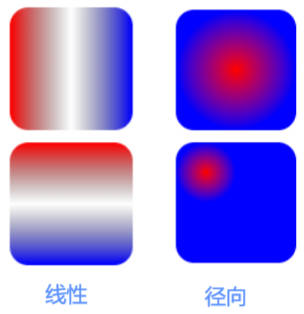

# 一、SVG 中的渐变

SVG 支持在填充和描边上应用渐变色，使用 `<linearGradient>`。

- 建议渐变内容定义在 `<defs>` 标签内部，因为渐变通常是可复用的。
- 编写渐变时，必须给渐变内容指定一个 `id` 属性，用于 `<use>` 引用。

渐变有两种类型：**线性渐变**和**径向渐变**。



线性渐变，是沿着直线改变颜色。使用步骤：

1. `<defs>` 元素内部，创建一个 `<linearGradient>` 节点，并添加 `id` 属性。
2. `<linearGradient>` 内编写几个 `<stop>` 元素。
	- 给 `<stop>` 元素指定 `offset`（位置）属性和 `stop-color`（颜色）属性，用来指定渐变在特定的位置上应用什么颜色（这两个属性值，也可以通过 CSS 来指定）。
	- 给 `<stop>` 元素指定 `stop-opacity`（透明度）属性。
3. 在一个元素的 `fill` 属性或 `stroke` 属性中通过 id 选择器来引用 `<linearGradient>` 节点。如 `fill=url(#Gradient2)`。
4. `<linearGradient>` 控制渐变方向：
	- 通过 `x1, y1` 和 `x2, y2` 属性控制，`(0, 0) (0, 1)` 从上到下；`(0, 0) (1, 0)` 从左到右。
	- 也可通过 `gradientTransform` 属性设置形变。比如：`gradientTransform=“rotate(90)` 表示从上到下。

03-SVG\demo-project\10-渐变色和滤镜效果\01-渐变色.html

```xml
<svg width="300" height="300" xmlns="http://www.w3.org/2000/svg">
	<!-- defs 定义可以复用的元素，样式，渐变，图形，滤镜... -->
	<defs>
		<linearGradient id="gradient1">
			<stop offset="0%" stop-color="red"></stop>
			<stop offset="50%" stop-color="green"></stop>
			<stop offset="100%" stop-color="blue"></stop>
		</linearGradient>
		<!-- 控制渐变色方司 -->
		<linearGradient id="gradient2" x1="0" y1="0" x2="1" y2="1">
			<stop offset="0%" stop-color="red"></stop>
			<stop offset="50%" stop-color="green"></stop>
			<stop offset="100%" stop-color="blue"></stop>
		</linearGradient>
		<!-- 渐变形变（了解） -->
		<linearGradient id="gradient3" gradientTransform="rotate(90)">
			<stop offset="0%" stop-color="red"></stop>
			<stop offset="50%" stop-color="green"></stop>
			<stop offset="100%" stop-color="blue"></stop>
		</linearGradient>
	</defs>

	<rect x="0" y="0" width="100" height="100" fill="url(#gradient1)"></rect>
	<rect x="100" y="0" width="100" height="100" fill="url(#gradient2)"></rect>
	<rect x="0" y="100" width="100" height="100" fill="url(#gradient3)"></rect>
</svg>
```

# 二、SVG 毛玻璃效果

在前端开发中，毛玻璃效果有几种方案来实现：

## 1.方案一：CSS

使用 CSS 的 `backdrop-filter` 或 `filter` 属性：

- `backdrop-filter`：可以给一个元素后面区域添加模糊效果。适用于元素背后的所有元素。为了看到效果，必须使元素或其背景至少部分透明。
- `filter`：直接将模糊效果应用于指定的元素。

03-SVG\demo-project\10-渐变色和滤镜效果\02-CSS实现毛玻璃效果.html

```html
<!DOCTYPE html>
<html lang="en">
<head>
	<meta charset="UTF-8">
	<meta http-equiv="X-UA-Compatible" content="IE=edge">
	<meta name="viewport" content="width=device-width, initial-scale=1.0">
	<title>CSS实现毛玻璃效果</title>
	<style>
		body {
			margin: 0;
			padding: 0;
		}
		.box {
			position: relative;
			width: 200px;
			height: 200px;
		}
		.bg-cover {
			position: absolute;
			left: 0;
			top: 0;
			right: 0;
			bottom: 0;
			/* 毛玻璃效果 */
			background-color: transparent;
			backdrop-filter: blur(8px);
		}

		.image-filter {
			filter: blur(8px);
		}
	</style>
</head>
<body>
  <!-- backdrop-filter -->
	<div class="box">
		
		<div class="bg-cover"></div>
	</div>
  <!-- filter -->
	<div class="box">
		
	</div>
</body>
</html>
```

## 2.方案二：SVG

使用 svg 的 `<filter>` 和 `<feGaussianBlur>` 元素（建议少用）：

`<filter>` 元素定义滤镜效果，`x`，`y`，`width`，`height` 属性定义在画布上应用此过滤器的矩形区域；

- `x`，`y` 默认值为 `-10%`（相对自身）；`width` ，`height` 默认 值为 `120%` （相对自身）。
- 通过 SVG 元素上的 `filter` 属性引用。

`<feGaussianBlur>`：对图像进行高斯模糊，`stdDeviation` 属性指定模糊的程度；

`<feOffset>`：指定输入图像的偏移量。

03-SVG\demo-project\10-渐变色和滤镜效果\04-SVG的滤镜效果-模糊效果-区域.html

```xml
<svg width="200" height="200" xmlns="http://www.w3.org/2000/svg" >
	<defs>
		<!-- 高斯模糊的 效果 -->
		<filter id="blurFilter" x="50%" y="50%" width="50%" height="25%">
			<feGaussianBlur stdDeviation="8"></feGaussianBlur>
		</filter>
	</defs>
  
	<image
		href="../images/avatar.jpeg"
		width="200"
		height="200"
		filter="url(#blurFilter)"
	>
	</image>
</svg>
```

# 三、SVG 的形变

`transform` 属性用来定义元素及其子元素的形变的列表。

- 可以与任何一个 SVG 中的元素一起使用。会**在该元素内部建立一个新的坐标系统**。
- 从 SVG2.0 开始，`transform` 它是一个 **Presentation Attribute**，意味着它也可以用作 CSS 属性。
- `transform` 同时作为 CSS 属性和元素属性（attribute），语法上会存在一些差异。
	- 比如作为元素属性（attribute）时：仅支持 2D 变换，不需单位；
	- 比如作为元素属性（attribute）时 `rotate()` 可指定旋转原点。

`transform` 属性支持的函数：

- `translate(x， y)`：平移。
- `rotate(z)` / `rotate(z，cx，cy)`：旋转。
- `scale(x, y)`：缩放。
- `skew(x, y)`：倾斜。
- `matrix(a, b, c, d, e)`：2*3 的形变矩阵

## 1.平移 translate

03-SVG\demo-project\11-SVG的形变\01-平移-translate.html

```xml
<svg width="300" height="300" xmlns="http://www.w3.org/2000/svg">
	<!-- 平移一个元素 -->
	<rect transform="translate(200, 200)" x="0" y="0" width="100" height="50" ></rect>
	<!--  平移一个元素，在元素内部创建一个新的坐标系-->
	<rect transform="translate(100, 100)" x="10" y="10" width="100" height="50" ></rect>
	<g transform="translate(100, 0)">
		<rect x="10" y="10" width="100" height="50"></rect>
	</g>
</svg>
```

## 2.旋转 rotate

`rotate(deg, cx, cy)` 函数。仅支持 2D 变化。

- 一个值时，设置以 `z` 轴为轴心，进行旋转的角度。
- 三个值时，后两个值 `cx`, `cy` 指定旋转的圆点（相对于自身坐标系）。

03-SVG\demo-project\11-SVG的形变\02-旋转-rotate.html

```xml
<svg width="300" height="300" xmlns="http://www.w3.org/2000/svg">
	<!-- 旋转一个元素 -->
	<rect transform="translate(100, 0) rotate(45, 50, 25)" x="0" y="0" width="100" height="50"></rect>
</svg>
```

## 3.缩放 scale

`scale(x, y)` 函数。仅支持 2D 变化。

- 一个值时：第二个值默认等于第一个值。
- 二个值时：x，y 轴的缩放比例。

03-SVG\demo-project\11-SVG的形变\03-缩放-scale.html

```xml
<svg width="300" height="300" xmlns="http://www.w3.org/2000/svg">
	<!-- 缩放一个元素 -->
	<rect transform="translate(50, 50) scale(1, 2)" x="0" y="0" width="100" height="50" ></rect>
	<!-- 修改缩放的原点 -->
	<rect transform="translate(100, 100) scale(2)" x="25" y="25" width="50" height="50" ></rect>
	<!-- 修改缩放的原点 -->
	<g transform="scale(2)">
		<rect transform="translate(10, 10)" x="0" y="0" width="50" height="50"></rect>
	</g>
</svg>
```

# 四、SVG 描边动画

`<svg>` 的 `stroke` 属性，专门给图形描边。

想给各种描边添加动画效果，需用到下面两个属性：

- `stroke-dasharray = “number [, number , …]”`：将虚线类型应用在描边上，值必须是用**逗号**分割的数，其中空格会被忽略。比如 `3，5` :
  - 第一个表示填色区域的长度为 3；
  - 第二个表示非填色区域的长度为 5。

- `stroke-dashoffset`：指定在 **dasharray 模式**下路径的偏移量。
- 值为 number 类型，除了可以正值，也可以取负值。

描边动画实现步骤：

1. 先将描边设置为虚线。
2. 再将描边偏移到不可见处。
3. 通过动画改变偏移量，让描边变为可见，偏移量设置的大，则动画效果快。

03-SVG\demo-project\12-SVG描边动画\04-stroke描边动画效果4.html

```html
<!DOCTYPE html>
<html lang="en">
<head>
	<meta charset="UTF-8">
	<meta http-equiv="X-UA-Compatible" content="IE=edge">
	<meta name="viewport" content="width=device-width, initial-scale=1.0">
	<title>渐变色和滤镜效果</title>
	<style>
		body {
			padding: 0;
			margin: 0;
			background-image: url(../images/grid.png);
		}
		svg {
			background-color: rgba(255, 0, 0, 0.1);
		}

		#line1 {
			/* 指定为虚线 */
			stroke-dasharray: 130;
			/* 初始状态：不可见 */
			stroke-dashoffset: 130px;
			animation: lineMove 2s linear forwards; /* 停留在最后一帧 */
		}

		@keyframes lineMove {
			to {
				stroke-dashoffset: 0;
			}
		}
	</style>
</head>
<body>
	<svg width="300" height="300" xmlns="http://www.w3.org/2000/svg">
		<path
			id="line1"
			d="M 100 70, L 200 70, L 200 100"
			stroke="red"
			stroke-width="10"
			fill="transparent"
		>
		</path>
	</svg>
</body>
</html>
```

# 五、SVG 实现雪糕描边案例

实现步骤：

1. 找到一个雪糕的 SVG 图片（设计师提供 | 网站下载）。
2. 将雪糕的每一个路径都改成虚线。
3. 将每个路径的描边都偏移到虚线的空白处（不可见）。
4. 给每个路径添加动画，将路径描边偏移到虚线填充处，即可。

03-SVG\demo-project\12-SVG描边动画\05-雪糕动画案例.html

# 六、SVG 动画实现方式总结

方式一：用 JS 脚本实现：给 SVG 创建动画和开发交互式的用户界面。

方式二：用 CSS 样式实现：SVG 也是文档对象模型（DOM）中的一部份，可应用 CSS。

方式三：用 SMIL 语言实现：

# 七、SMIL 是什么？

SMIL（Synchronized Multimedia Integration Language 同步多媒体集成语言）是 W3C 推荐的可扩展标记语言，用于描述多媒体演示。

- SMIL 标记是用 XML 编写的，与 HTML 有相似之处。
- SMIL 允许开发多媒体项目，例如：文本、图像、视频、音频等。
- SMIL 定义了时间、布局、动画、视觉转换和媒体嵌入等标记，比如：`<head> <body> <seq> <par> <excl>` 等元素。

SMIL 的应用

- 目前最常用的 Web 浏览器基本都支持 SMIL 语言。
- SVG 动画元素是基于 SMIL 实现（SVG 中使用 SMIL 实现元素有：`<set>、<animate>、<animateMotion>`...）。

> 使用 SMIL 制作的播放器有：
>
> - Adobe Media Player implement SMIL playback。
> - QuickTime Player implement SMIL playback。

# 八、SMIL 实现动画的优势

编写简单，只需在页面放几个元素，如 `<animate>` ，就可以实现强大的动画效果，无需任何 CSS 和 JS 代码。

支持声明式动画。不需指定如何做某事，而是指定最终结果应该是什么，将实现细节留给客户端软件.
- 在 JavaScript 中，动画通常使用 `setTimeout()` 或 `setInterval()` 等方法实现，这些方法需要手动管理动画的时间。
- 而 SMIL 声明式动画可以让浏览器自动处理。
  - 比如：动画轨迹直接与动画对象相关联、物体和运动路径方向、管理动画时间等等。

阅读性好，SMIL 动画与对象本身是紧密集成的。

# 九、SMIL 动画元素

包括了 `<set> <animate> <animateColor> <animateMotion>` 等等。[更多](https://www.w3.org/TR/SVG11/animate.html#AnimationElements)

## 1.set 元素

`<set>` 是最简单的 SVG 动画元素。它是在经过特定时间间隔后，将属性设置为某个值。

- 不是连续动画，而是改变一次属性值。

它支持所有属性类型，包括那些无法合理插值的属性类型：，

- 例如：字符串和布尔值。而对于可以合理插值的属性通常首选 `<animate>` 元素。

常用属性：

- `attributeName`：动画期间更改的目标元素的 CSS 属性或元素属性（attribute）的名称。
- ~~`attributeType`~~：（已过期，不推荐）指定目标属性的类型（值为：CSS | XML | auto）。
- `to`：定义在特定时间设置目标属性的值。该值必须与目标属性的要求相匹配。 值类型：anything；默认值：无
- `begin`：定义何时开始动画或何时丢弃元素，默认是 0s (begin 支持多种类型的值)。

03-SVG\demo-project\13-SVG的SMIL动画\01-set元素-动画.html

```xml
<!-- 在3秒后自动将长方形瞬间移到右边 -->
<svg width="300" height="300" xmlns="http://www.w3.org/2000/svg">
	<rect x="0" y="0" width="100" height="50" fill="red">
		<set attributeName="x" to="200" begin="3s"></set>
	</rect>
</svg>

<!-- 点击长方形后，长方形瞬间移到右边 -->
<svg width="300" height="300" xmlns="http://www.w3.org/2000/svg">
	<rect id="rectangle" x="0" y="0" width="100" height="50" fill="green">
		<set attributeName="x" to="200" begin="rectangle.click"></set>
	</rect>
</svg>
```

## 2.animate 元素

`<animate>` 元素给某个属性创建过度动画效果。需嵌套在应用动画的元素内。

常用的属性：

- `attributeName`：指将在动画期间更改目标元素的 CSS 属性或元素（attribute）属性的名称。
- 动画值属性：

	- `from`：动画期间属性的初始值。没有默认值。
	- `to`：动画期间属性的最终值。没有默认值。
	- `values`：该属性具有不同的含义，具体取决于使用它的上下文（没有默认值）。
		- 它定义了在动画过度中使用的一系列值，值需要用**分号**隔开，比如：`values=“2; 3; 4; 5”`。
		- 当 `values` 属性定义时，`from`、`to` 会被忽略。

- 动画时间属性：

	- `begin`：定义何时开始动画或何时丢弃元素。默认是 0s 。
	- `dur`：（必填）动画持续时间，要求大于 0。单位可以用小时 (h)、分钟 (m)、秒 (s) 或毫秒 (ms) 表示。
	- `fill`：定义动画的最终状态。 `freeze`（保持最后一个动画帧的状态） | `remove`（保持第一个动画帧的状态）。
	- `repeatCount`：指示动画将发生的次数：`[number]` | `indefinite`。没有默认值。

03-SVG\demo-project\13-SVG的SMIL动画\02-animate元素-动画.html

```xml
<svg width="300" height="300" xmlns="http://www.w3.org/2000/svg">
  
	<rect x="0" y="0" width="100" height="50" fill="red">
		<!-- animate 元素基本使用 -->
		<animate
			attributeName="x"
			from="0"
			to="200"
			dur="3s"
			begin="2s"
			fill="freeze"
		></animate>
	</rect>
  
	<rect x="0" y="100" width="100" height="50" fill="red">
		<!-- animate 元素基本使用，3个属性是必须的 -->
		<animate
			attributeName="x"
			to="200"
			dur="3s"
		></animate>
	</rect>
  
</svg>

<svg width="300" height="300" xmlns="http://www.w3.org/2000/svg">
  
	<rect x="0" y="0" width="100" height="50" fill="skyblue">
		<!-- value 属性的使用 -->
		<animate
			attributeName="x"
			values="0; 170; 200"
			dur="3s"
			repeatCount="indefinite"
		></animate>
	</rect>
  
	<rect x="0" y="100" width="100" height="50" fill="skyblue">
		<!-- value 属性的使用 -->
		<animate
			attributeName="fill"
			values="pink; skyblue"
			dur="3s"
			repeatCount="indefinite"
		></animate>
	</rect>
  
</svg>


<svg width="300" height="300" xmlns="http://www.w3.org/2000/svg">
  
	<rect x="0" y="0" width="100" height="50" fill="skyblue">
		<!-- 动画的衔接 -->
		<animate
			id="firstAnimate"
			attributeName="x"
			values="0; 200"
			dur="3s"
			fill="freeze"
		></animate>
		<animate
			attributeName="y"
			values="0; 100"
			begin="firstAnimate.end"
			dur="3s"
			fill="freeze"
		></animate>
	</rect>
  
</svg>
```
