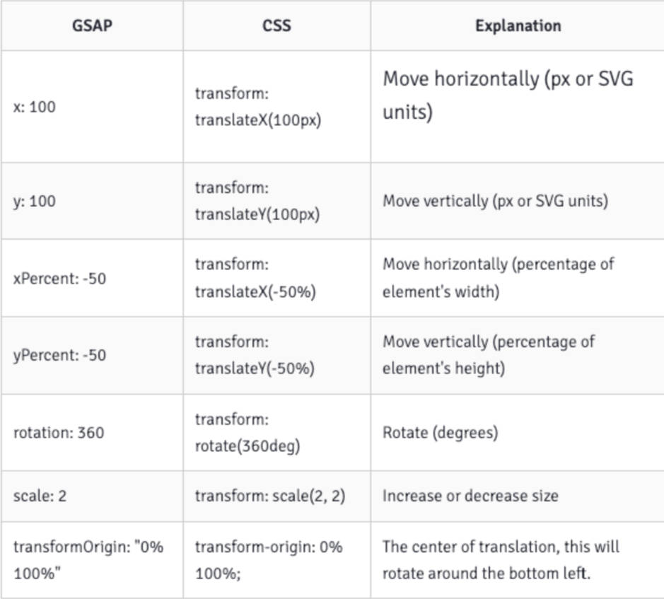

# GSAP 动画库

什么是 GSAP ？[官网](https://greensock.com/)

- GSAP 全称是（GreenSock Animation Platform）。
- GSAP 是一个强大的 JavaScript 动画库，可让开发人员轻松的制作各种复杂的动画。

GSAP 动画库的特点

- GSAP 支持 HTML 元素、SVG、Vue、React 组件的动画。
- GSAP 还提供了一些插件，用最少的代码实现炫酷的动画，比如：[ScrollTrigger 插件](https://greensock.com/scrolltrigger)和 MorphSVG 插件。
- GSAP 的核心是一个高速的属性操纵器，随着时间的推移，它以极高的准确性更新值。它比 jQuery 快 20 倍！
- GSAP 使用起来非常灵活，在需要动画的地方基本都可以使用，并且是零依赖。

# GSAP 初体验

移动 SVG 中的一个矩形：

- 引入 gsap.js 动画库（引入方式：1.CDN；2.本地引入；3.npm）。
- 调用 `gsap.to` 方法来执行 tween（补间/过度）动画。

03-SVG\demo-project\16-第三方动画库-gsap\01-gsap的初体验.html

```html
<body>

	<svg width="300" height="300" xmlns="http://www.w3.org/2000/svg">
		<rect id="rectangle" x="0" y="0" width="100" height="50" fill="skyblue"></rect>
	</svg>

	<!-- window.gsap -->
	<script src="https://cdnjs.cloudflare.com/ajax/libs/gsap/3.11.4/gsap.min.js"></script>
	<script>
		window.onload = function() {
			gsap.to('#rectangle', {
				x: 200,
				duration: 2 // 秒
			})
		}
	</script>
</body>
```

# GSAP 的补间动画

tween 动画，又称补间动画，有4种类型：

- `gsap.from(targets | selector, vars)`：元素从 `from` 定义的状态过度到元素当前的状态。
	- `targets | selector` ：需动画的元素对象，支持字符串的选择器。
	- `vars`: 一个对象，包括了需动画的属性和 GSAP 扩展的属性，如 `duration`、`ease`、`transformOrigin`、`repeat`、`delay`、`yoyo`、`stagger`、`onComplete` ……
	- [官网 gsap.form 文档](https://greensock.com/docs/v3/GSAP/gsap.from())
- `gsap.to(targets | selector, vars)`：元素从当前的状态过度到 `to` 状态。
- `gsap.fromTo(targets | selector, fromVars， toVars)`：元素从 `from` 定义状态过度到 `to` 定义的状态。
- `gsap.set(targets | selector, vars)`：立即设置属性（无过度效果）。
	- 本质上是一个 `duration = 0` 的 `to` 补间动画。

GSAP 几乎可以为任何属性制作动画

- 包括 CSS 属性、元素属性（attribute）、自定义对象属性。
- 甚至 CSS 变量和复杂的字符串。
- 还专门为 CSS 形变（transform）相关属性提供了简写，如下图所示：[官网形变文档](https://greensock.com/get-started/#transformShorthand)

  

03-SVG\demo-project\16-第三方动画库-gsap\02-gsap-补间动画-tween.html

```html
<body>

  <svg width="300" height="300" xmlns="http://www.w3.org/2000/svg" >
    <rect id="rectangle1" x="0" y="0" width="100" height="100" fill="skyblue"
    onclick="onRectClick1()" 
    ></rect>
    <rect id="rectangle2" x="100" y="0" width="100" height="100" fill="orange"
    onclick="onRectClick2()" 
    ></rect>
    <rect id="rectangle3" x="200" y="0" width="100" height="100" fill="purple"
    onclick="onRectClick3()" 
    ></rect>
    <rect id="rectangle4" x="0" y="100" width="100" height="100" fill="lime"
    onclick="onRectClick4()" 
    ></rect>
    <rect id="rectangle5" x="100" y="100" width="100" height="100" fill="deepskyblue"
    onclick="onRectClick5()" 
    ></rect>
  </svg>

  <!-- 
    window.gsap = {}
   -->
	<script src="https://cdnjs.cloudflare.com/ajax/libs/gsap/3.11.4/gsap.min.js"></script>
   <script>

    function onRectClick1() {
      // 补间动画( 参数一也是支持数组的 )
      gsap.to(['#rectangle1'], {
        scale: 0.5, // 1 - 0.5
        duration: 1
      })
    }

    function onRectClick2() {
      gsap.from(['#rectangle2'], {
        scale: 0.3,  // 0.3 - 1
        duration: 1
      })
    }

    function onRectClick3() {
      gsap.fromTo(['#rectangle3'], {
        scale: 0, 
        // duration: 4 // 可省略
      }, {
        scale: 1,  
        duration: 2,
        repeat:1, // 重复一次
      })
    }

    function onRectClick4() {
      gsap.to(['#rectangle4'], {
        scale: 0.5,
        duration: 1,
        transformOrigin: 'center'  // 动画的原点，left, top, right, bottom
      })
    }

    function onRectClick5() {
      gsap.to(['#rectangle5'], {
        scale: 0.5, // 1 - 0.5
        duration: 1,
        transformOrigin: 'center',  // 动画的原点
        ease: 'bounce.out'   // power1.out
      })
    }
    
   </script>
</body>
```

# GSAP 的动画时间线

时间线（TimeLine）用来创建易于调整、有弹性的动画序列。

将补间添加到时间线（Timeline）时，默认情况下，它们会按照添加到时间轴的顺序一个接一个地播放。

TimeLine 的使用步骤：

1. `gsap.timeline(vars)` 拿到时间线对象。[timeline 文档](https://greensock.com/docs/v3/GSAP/Timeline)
2. 调用时间线上的 Tween 动画方法，比如：`form`、`to` 等。

使用 `delay` 实现动画时间线：

03-SVG\demo-project\16-第三方动画库-gsap\03-gsap动画时间线-delay.html

```html
<body>

  <svg width="300" height="300" xmlns="http://www.w3.org/2000/svg" >
    <rect id="rectangle1" x="0" y="0" width="50" height="50" fill="skyblue" onclick="scaleRectangle()" ></rect>
    <rect id="rectangle2" x="100" y="0" width="50" height="50" fill="orange"></rect>
    <rect id="rectangle3" x="200" y="0" width="50" height="50" fill="purple"></rect>
  </svg>

	<script src="https://cdnjs.cloudflare.com/ajax/libs/gsap/3.11.4/gsap.min.js"></script>
  <script>
  function scaleRectangle() {
    // 1 - 3
    gsap.to('#rectangle1', {
      scale: 0.5,
      duration: 1
    })

    gsap.to('#rectangle2', {
      scale: 0.5,
      duration: 1,
      delay: 1
    })

    gsap.to('#rectangle3', {
      scale: 0.5,
      duration: 1,
      delay: 2
    })
  }
  </script>
</body>
```

使用 `timeline` 实现动画时间线

03-SVG\demo-project\16-第三方动画库-gsap\04-gsap动画时间线-timeline.html

```html
<body>

  <svg width="300" height="300" xmlns="http://www.w3.org/2000/svg" >
    <rect id="rectangle1" x="0" y="0" width="50" height="50" fill="skyblue" onclick="scaleRectangle()" ></rect>
    <rect id="rectangle2" x="100" y="0" width="50" height="50" fill="orange"></rect>
    <rect id="rectangle3" x="200" y="0" width="50" height="50" fill="purple"></rect>
  </svg>

	<script src="https://cdnjs.cloudflare.com/ajax/libs/gsap/3.11.4/gsap.min.js"></script>
  <script>
  function scaleRectangle() {
    const timeline = gsap.timeline()
    timeline.to(['#rectangle1', '#rectangle2'], {
      scale: 0.5,
      duration: 1
    })
    .to('#rectangle3', {
      scale: 0.5,
      duration: 1,
    })
  }
  </script>
</body>
```

# GSAP + SVG 动画案例

03-SVG\demo-project\16-第三方动画库-gsap\05-滑板车生成动画.html