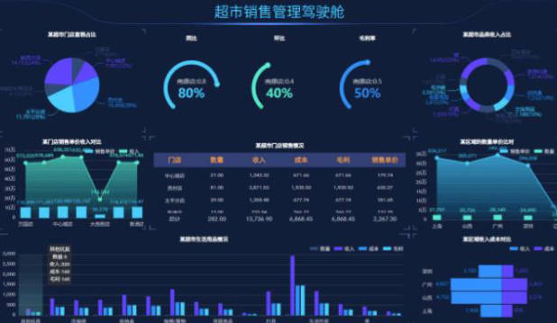
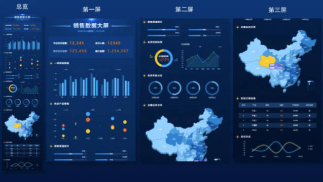
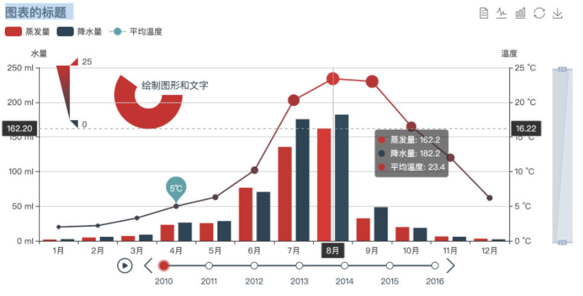
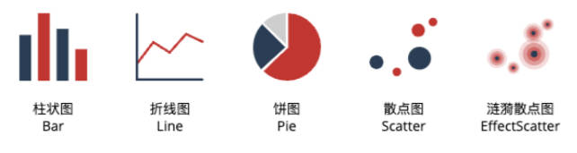

# ECharts 是什么

ECharts（全称 Enterprise Charts）企业级数据图表。官方的解释：一个基于 JavaScript 的开源可视化图表库。

ECharts 可以流畅的运行在 PC 和移动设备上，兼容当前绝大部分浏览器（IE6/7/8/9/10/11，chrome，firefox，Safari 等）。

ECharts 底层依赖轻量级的 ZRender 图形库，可提供直观，生动，可交互，可高度个性化定制的数据可视化图表。

# Echarts 的发展历史

1. ECharts 由百度团队开源。
2. 2018 年初，捐赠给 Apache 基金会，成为 Apache 软件基金会孵化级项目。
3. 2021 年 1 月 26 日晚，Apache 基金会官方宣布 ECharts 项目正式毕业，成为 Apache 顶级项目。
4. 2021 年 1 月 28 日，ECharts5 线上发布会举行。

# ECharts 的应用场景

智慧城市、园区、航运、公安、机房、监所、电力、物业、应急管理等多个领域的数据可视化展示。





# ECharts 的特点

丰富的图表类型
- 提供开箱即用的二十多种图表和十几种组件，
- 支持各种图表以及组件的任意组合；

强劲的渲染引擎
- Canvas、SVG 双引擎灵活切换，增量渲染等技术实现千万级数据的流畅交互；

简单易容，上手容易
- 直接通过编写配置，便可以生成各种图表，并且支持多种集成方式；

活跃的社区
- 活跃的社区用户保证了项目的健康发展，也贡献了丰富的第三方插件满足不同场景的需求；

# ECharts 初体验

集成 Echarts 的常见方式：

- 通过 jsDelivr 等 CDN 引入。
- 通过 npm 获取 echarts：`npm install echarts`

> ECharts 的容器必须设高度。

04-Echart\demo-project\01-ECharts初体验\01-ECharts初体验.html

```html
<body>
	<!-- 作为 ECharts 的容器，必须要有高度 -->
	<div id="main" style="height: 400px;"></div>

	<script src="https://cdn.jsdelivr.net/npm/echarts@5.4.1/dist/echarts.min.js"></script>
	<script>
		window.onload = function () {
			// 1.初始化 echarts 实例
			const myChart = echarts.init(document.getElementById('main'))

			// 2.指定图表的配置项和数据
			const option = {
				title: {
					text: 'ECharts 入门示例'
				},
				legend: {
					data: ['销量']
				},
				xAxis: {
					data: ['衬衫', '羊毛衫', '雪纺衫', '裤子', '高跟鞋', '袜子']
				},
				yAxis: {},
				series: [
					{
						name: '销量',
						type: 'bar',
						data: [5, 20, 36, 10, 10, 20]
					}
				]
			}
      
			myChart.setOption(option)
		}
	</script>
</body>
```

精简版的配置选项，仅包含必填项：

```js
let option = {
	xAxis: {
		data: ['衬衫', '羊毛衫', '雪纺衫', '裤子', '高跟鞋', '袜子']
	},
	yAxis: {},
	series: [
		{
			type: 'bar',
			data: [5, 20, 36, 10, 10, 20]
		}
	]
};
```

# ECharts 渲染原理

浏览器端的图表库大多会选择 SVG 或者 Canvas 进行渲染。

- ECharts 最初一直都是使用 Canvas 绘制图表。直到 ECharts v4.0 版本，才支持 SVG 渲染器。
- SVG 和 Canvas 渲染在技术上有很大的差异，EChart 能够做到同时支持，主要归功于 ECharts 底层使用 ZRender 库进行抽象和实现。
- ZRender 是二维轻量级的绘图引擎，它提供 Canvas、SVG、VML 等多种渲染方式。
- 因此，Echarts 可以轻松的互换 SVG 和 Canvas 渲染器。切换渲染器只须在初始化图表时设置 `{renderer: "canvas"}` 或 `{renderer: "svg"}` 即可。

切换渲染模式：

04-Echart\demo-project\01-ECharts初体验\03-ECharts-切换渲染器.html

```js
window.onload = function() {
	// 切换为 svg 的渲染器（默认是 canvas）
	const myChart = echarts.init(document.getElementById('main'), null, { renderer: 'svg' });

	const option = {
		xAxis: {
			data: ['衬衫', '羊毛衫', '雪纺衫', '裤子', '高跟鞋', '袜子']
		},
		yAxis: {},
		series: [
			{
				type: 'bar',
				data: [5, 20, 36, 10, 10, 20]
			}
		]
	};
  
	myChart.setOption(option);
}
```

# svg 和 canvas 渲染模式应如何选择？

在软硬件环境较好，数据量不大的场景下，两种渲染器都可以适用，并不需要太多纠结；

在软硬件环境较差，出现性能问题需要优化的场景下，可以通过试验来确定使用哪种渲染器。

- 创建很多 ECharts 实例，浏览器易崩溃的时（可能因为 Canvas 数量多导致内存占用超出手机承受能力），用 SVG 渲染器。
	- SVG 具有内存占用更低、适配性、扩展性好，放大缩小图表不会模糊的优势。
- 数据量较大、较多交互时，建议选择 Canvas 渲染器。
	- Canvas 更适合绘制图形元素数量较多的图表。如，热力图、炫光尾迹特效、地理坐标系、平行坐标系上的大规模线图等。

# option 配置项（组件）

ECharts 配置项（options）有哪些？或者说组成 ECharts 的组件有哪些？

- `backgroundColor`: 设置直角坐标系内绘图区域的背景。
- `grid`: 直角坐标系内绘图区域。
- `yAxis`: （必填）直角坐标系 grid 中的 y 轴。
- `xAxis`: （必填）直角坐标系 grid 中的 x 轴。
- `title`: 图表的标题。
- `legend`: 图例，展现了不同系列的标记、颜色和名字。
- `tooltip`: 提示框。
- `toolbox`: 工具栏，提供操作图表的工具。
- `series`: （必填）系列，配置系列图表的类型和图形信息数据。
- `visualMap`: 视觉映射，可以将数据值映射到图形的形状、大小、颜色等。
- `geo`：地理坐标系组件。用于地图的绘制，支持在地理坐标系上绘制散点图，线集。

一个完整的 ECharts：



图形种类



# grid 网格配置

grid 选项 ：直角坐标系内绘图区域：

- `show`: 是否显示直角坐标系网格。 boolean 类型。
- `left`、`right`、`top`、`bottom`：grid 组件离容器左右上下的距离。 string | number 类型。
- `containLabel`：grid 区域是否包含坐标轴的刻度标签。 boolean 类型。
- `backgroundColor`：网格背景色，默认透明。

04-Echart\demo-project\02-ECharts的组件和配置\01-Grid-组件-配置.html

```js
const option = {
	grid: {
		show: true,
		backgroundColor: 'rgba(0, 255, 0, 0.1)',
		top: 0,
		bottom: 0,
		left: 0,
		right: 0,
		containLabel: false, // 效果：当 left: 0, 时，y 轴会紧贴容积左边
	},
}
```

# xAsis，yAsis 坐标系配置

`xAxis` 选项：直角坐标系 grid 中的 x 轴。

- `show`：是否显示 x 轴。boolean 类型。
- `name`：坐标轴名称。
- `type`：坐标轴类型。string 类型。
	- `value`: 数值轴，适用于连续数据。
	- `category`: 类目轴，适用于离散的类目数据。类目数据可来源 `xAxis.data`、`series.data` 或 `dataset.source` 之一。
- `data`：类目数据，在类目轴（`type: 'category'`）中有效。 array 类型
- `axisLine`： 坐标轴轴线相关设置。object 类型
- `axisTick`：坐标轴刻度相关设置。object 类型
- `axisLabel`：坐标轴刻度标签的相关设置。object 类型
- `splitLine`：坐标轴在 grid 区域中的分隔线。object 类型

`yAxis` 选项：直角坐标系 grid 中的 y 轴，参数基本和 xAxis 差不多。

04-Echart\demo-project\02-ECharts的组件和配置\02-xAxis-坐标系组件-配置.html

```js
const option = {
	xAxis: {
		show: true,
		name: "类目坐标",
		type: "category", // 类目坐标才有 data 选项
		data: ['衬衫', '羊毛衫', '雪纺衫', '裤子', '高跟鞋', '袜子'],
		axisLine: { // 坐标轴轴线设置。
			show: true,
			lineStyle: {
				color: "red",
				width: 3,
			},
		},
		axisLabel: { // 坐标轴刻度标签的设置。
			show: true,
			color: "green",
			fontSize: 16,
		},
		axisTick: {  // 坐标轴刻度相关设置。
			show: true,
			length: 10,
			lineStyle: {
				color: "blue",
				width: 3,
			},
		},
		splitLine: { // 坐标轴在 grid 区域中的分隔线。
			show: true,
			lineStyle: {
				color: "orange",
				width: 1,
			},
		},
	},
	yAxis: {
		name: '数量 / 件'
	},
}
```

# series 系列图配置

`series`：配置图表的类型和图形信息数据。object[] 类型，每个 object 具体配置信息如下

- `name`：系列名称，用于 tooltip 的显示，legend 的图例筛选等。
- `type`：指定系列图表的类型，比如：柱状图（`bar`）、折线图（`line`）、饼图（`pie`）、散点图（`scatter`）、地图等
- `data`：数值内容数组。数组中的每一项称为数据项。
	- 一维数组: `[value，value]`（一维数组是二维数组的简写）。
	- 二维数组。
		- `[[index, value]`，`[index, value]]`，`x` 轴和 `y` 轴的值，注意 `index` 从 0 开始。
		- `[[x, y, value]`，`[x, y，value]]`，注意这里的 `x` 和 `y` 可以表示 x 轴和 y 轴，也可以表示经度和纬度等信息。
	- 对象写法（推荐）。`data: [{ value: x， name: x， label: {}，itemStyle:{}、 emphasis:{} .... }]`
- `label`：图形上的文本标签（就近原则，`data` 选项的比 `series` 选项的优先级高）。
- `itemStyle`：图形样式。
- `emphasis`：高亮的图形样式和标签样式。
- `coordinateSystem`：该系列使用的坐标系，默认值为二维的直角坐标系（笛卡尔坐标系，y 轴向上，x 轴向右）


## data 属性的使用

方式一：一维数组

04-Echart\demo-project\02-ECharts的组件和配置\03-ECharts-series-系列图-data.html

```js
const option = {
	series: [
		{
			type: 'bar',
			label: {
				show: true // 在柱状图上显示数字
			},
			data: [5, 20, 36, 10, 10, 20],

		}
	]
}
```

方式二：二维数组，制定了数值对应的 x 轴坐标索引（意味着数组元素可以打乱顺序排列）。

04-Echart\demo-project\02-ECharts的组件和配置\03-ECharts-series-系列图-data.html

```js
const option = {
	series: [
		{
			type: 'bar',
			label: {
				show: true // 在柱状图上显示数字
			},
			data: [
				[2, 36], // index, value
			  [3, 10],
			  [4, 10],
			  [5, 20],
			  [0, 5],
			  [1, 20],
			],
		}
	]
}
```

方式三：对象写法，有更多的选项可供配置。

04-Echart\demo-project\02-ECharts的组件和配置\03-ECharts-series-系列图-data.html

写法一

```js
const option = {
	series: [
		{
			type: 'bar',
			label: {
				show: true // 在柱状图上显示数字
			},

			data: [
			  {
			    value: 5,
			    name: "衬衫", // 数据项名称, 比如 pie 系列 tooltip 需要用到
			    // ....
			  },
			  {
			    value: 20,
			    name: "羊毛衫",
			  },
			  {
			    value: 36,
			    name: "雪纺衫",
			  },
			  {
			    value: 10,
			    name: "裤子",
			  },
			  {
			    value: 10,
			    name: "高跟鞋",
			  },
			  {
			    value: 20,
			    name: "袜子",
			  },
			],
		}
	]
}
```

写法二

```js
const option = {
	series: [
		{
			type: 'bar',
			label: {
				show: true // 在柱状图上显示数字
			},

			data: [
				{
					value: [0, 5], // x 轴值，y 轴值
					name: "衬衫", // 数据项名称, 比如 pie 系列 tooltip 需要用到
				},
				{
					value: [1, 20],
					name: "羊毛衫",
				},
				{
					value: [2, 36],
					name: "雪纺衫",
				},
				{
					value: [3, 10],
					name: "裤子",
				},
				{
					value: [4, 10],
					name: "高跟鞋",
				},
				{
					value: [5, 20],
					name: "袜子",
				},
			],
		}
	]
}
```

写法三：适用于地图的写法。

```js
const option = {
	series: [
    {
      type: 'bar',
      label: {
        show: true // 在柱状图上显示数字
      },
      data: [
        {
          value: [0, 5, 500], // x 轴值或纬度，y 轴值或经度，第三项以后为扩展值
          name: "衬衫", // 数据项名称, 比如 pie 系列 tooltip 需要用到
        },
        {
          value: [1, 20, 400],
          name: "羊毛衫",
        },
        {
          value: [2, 36, 200],
          name: "雪纺衫",
        },
        {
          value: [3, 10, 100],
          name: "裤子",
        },
        {
          value: [4, 10, 600],
          name: "高跟鞋",
        },
        {
          value: [5, 20, 300],
          name: "袜子",
        },
      ],
    ]
  ]
}
```

## type 属性的使用

实现柱状图，实现折线图，实现散点图，

04-Echart\demo-project\02-ECharts的组件和配置\03-ECharts-series-系列图-type.html

```js
window.onload = function() {
	const myChart = echarts.init(document.getElementById('main'));
	const option = {
		backgroundColor: 'rgba(255, 0, 0, 0.1)',
		grid: {
			show: true,
			backgroundColor: 'rgba(0, 255, 0, 0.1)',
		},
		xAxis: {
			data: ['衬衫', '羊毛衫', '雪纺衫', '裤子', '高跟鞋', '袜子']
		},
		yAxis: {},
		series: [
			{
				type: 'scatter', // line 折线图；bar 柱状图；scatter 散点图；
				label: {
					show: true
				},
				data: [
					{
						value: 5,
						name: "衬衫",
					},
					{
						value: 20,
						name: "羊毛衫",
					},
					{
						value: 36,
						name: "雪纺衫",
					},
					{
						value: 10,
						name: "裤子",
					},
					{
						value: 10,
						name: "高跟鞋",
					},
					{
						value: 20,
						name: "袜子",
					},
				],
			}
		]
	};
	myChart.setOption(option);
}
```

实现饼图，实现圆环图，实现玫瑰图：

04-Echart\demo-project\02-ECharts的组件和配置\04-ECharts-series-系列图-type-pie.html

```js
window.onload = function() {
	const myChart = echarts.init(document.getElementById('main'));
	const option = {
		backgroundColor: 'rgba(255, 0, 0, 0.1)',
		grid: {
			show: true,
			backgroundColor: 'rgba(0, 255, 0, 0.1)',
		},
		xAxis: {
			show: false, // 饼图无需展示 x 轴坐标系
			data: ['衬衫', '羊毛衫', '雪纺衫', '裤子', '高跟鞋', '袜子']
		},
		yAxis: {},
		series: [
			{
				type: 'pie', // line bar scatter pie
				label: {
					show: true
				},
				center: ["50%", "50%"], // 饼图的中心（圆心）坐标，数组的第一项是横坐标，第二项是纵坐标。设置成百分比时第一项是相对于容器宽度，第二项是相对于容器高度。
				radius: ["20%", "80%"], // 饼图的内半径和外半径，数组的第一项是内半径，第二项是外半径。百分比参照直径。
				roseType: "area", // area 玫瑰图(南丁格尔图)。 圆心角一样，通过半径展现数据大小 (默认 false)。
				data: [
					{
						value: 5,
						name: "衬衫", // 数据项名称, 比如pie系列 tooltip 需要用到
					},
					{
						value: 20,
						name: "羊毛衫",
					},
					{
						value: 36,
						name: "雪纺衫",
					},
					{
						value: 10,
						name: "裤子",
					},
					{
						value: 10,
						name: "高跟鞋",
					},
					{
						value: 20,
						name: "袜子",
					},
				],
			}
		]
	};
	myChart.setOption(option);
}
```

## label 属性的使用

图形上的文本标签（优先级采用就近原则，`series` -> `data` -> `labbel` 大于 `series` -> `label`）

04-Echart\demo-project\02-ECharts的组件和配置\05-ECharts-series-系列图-label.html

```js
window.onload = function() {
	const myChart = echarts.init(document.getElementById('main'));
	const option = {
		backgroundColor: 'rgba(255, 0, 0, 0.1)',
		grid: {
			show: true,
			backgroundColor: 'rgba(0, 255, 0, 0.1)',
		},
		xAxis: {
			data: ['衬衫', '羊毛衫', '雪纺衫', '裤子', '高跟鞋', '袜子']
		},
		yAxis: {},
		series: [
			{
				name: "产品销量柱形图",
				type: "bar",
				// 系列图形上的文本标签
				label: {
					show: true,
					position: [10, 10], // 支持的类型可以查文档，不同type的position的值会有些差异
					color: "red",
					fontSize: 20,
				},
				data: [5, 20, 36, 10, 10, 20]
			}
		]
	};
	myChart.setOption(option);
}
```

## itemStyle 属性的使用，

图形样式（优先级采用就近原则，`series` -> `data` -> `labbel` 大于 `series` -> `label`）

04-Echart\demo-project\02-ECharts的组件和配置\06-ECharts-series-系列图-itemStyle.html

```js
window.onload = function() {
	const myChart = echarts.init(document.getElementById('main'));
	const option = {
		backgroundColor: 'rgba(255, 0, 0, 0.1)',
		grid: {
			show: true,
			backgroundColor: 'rgba(0, 255, 0, 0.1)',
		},
		xAxis: {
			data: ['衬衫', '羊毛衫', '雪纺衫', '裤子', '高跟鞋', '袜子']
		},
		yAxis: {},
		series: [
			{
				name: "产品销量柱形图",
				type: "bar",

				itemStyle: { // 系列图形的样式
					color: "green",
					borderColor: "orange",
					borderWidth: 4,
					opacity: 0.4,
				},

				data: [
					{
						value: 5,
						name: "衬衫", // 数据项名称, 比如pie系列 tooltip 需要用到
						itemStyle: { // 系列图形的样式
							color: "red",
						},
					},
					{
						value: 20,
						name: "羊毛衫",
						itemStyle: { // 系列图形的样式
							color: "orange",
						},
					},
					{
						value: 36,
						name: "雪纺衫",
						itemStyle: { // 系列图形的样式
							color: "pink",
						},
					},
					{
						value: 10,
						name: "裤子",
					},
					{
						value: 10,
						name: "高跟鞋",
					},
					{
						value: 20,
						name: "袜子",
					},
				],

			}
		]
	};
	myChart.setOption(option);
}
```

## emphasis 属性的使用


鼠标悬浮到图形元素上时，高亮的样式。

- 默认情况高亮的样式是根据普通样式自动生成。但是也可自己定义
- `emphsis` 的结构和普通样式结构相同。

04-Echart\demo-project\02-ECharts的组件和配置\07-ECharts-series-系列图-emphasis.html

```js
window.onload = function() {
	const myChart = echarts.init(document.getElementById('main'));
	const option = {
		backgroundColor: 'rgba(255, 0, 0, 0.1)',
		grid: {
			show: true,
			backgroundColor: 'rgba(0, 255, 0, 0.1)',
		},
		xAxis: {
			data: ['衬衫', '羊毛衫', '雪纺衫', '裤子', '高跟鞋', '袜子']
		},
		yAxis: {},
		series: [
			{
				name: "产品销量柱形图",
				type: "bar",
				label: {
					show: true,
				},
				itemStyle: {
					color: 'green'
				},
				emphasis: { // 图形高亮( label、labelLine、itemStyle、lineStyle、areaStyle... )
					label: {
						show: true,
						color: 'red'
					},
					itemStyle: {
						color: 'orange'
					},
					// .....
				},
				data: [
					{
						value: 5,
						name: "衬衫",
						emphasis: { // 图形高亮( label、labelLine、itemStyle、lineStyle、areaStyle... )
							label: {
								show: true,
								color: 'blue'
							},
							itemStyle: {
								color: 'pink'
							},
						},
					},
					{
						value: 20,
						name: "羊毛衫",
					},
					{
						value: 36,
						name: "雪纺衫",
					},
					{
						value: 10,
						name: "裤子",
					},
					{
						value: 10,
						name: "高跟鞋",
					},
					{
						value: 20,
						name: "袜子",
					},
				],

			}
		]
	};
	myChart.setOption(option);
}
```

ECharts 4 以前，的写法，这种写法 仍然被兼容，但是不再推荐了

```js
const obj = {
	// ...
	itemStyle: {
		color: 'green',
		emphasis: { // 图形高亮( label、labelLine、itemStyle、lineStyle、areaStyle... )
			label: {
				show: true,
				color: 'red'
			},
			itemStyle: {
				color: 'orange'
			},
			// .....
		},
	},
	// ...
}
```

# title 标题配置

图表的标题。object 类型。

04-Echart\demo-project\02-ECharts的组件和配置\08-ECharts-title-标题组件.html

```js
window.onload = function() {
	const myChart = echarts.init(document.getElementById('main'));
	const option = {
		backgroundColor: 'rgba(255, 0, 0, 0.1)',
		grid: {
			show: true,
			backgroundColor: 'rgba(0, 255, 0, 0.1)',
		},
		label: {
			show: true
		},
		title: {
			show: true,
			text: "Echart 5 条形图",
			left: 20,
			top: 10,
			subtext: '第二个标题'
			// ....
		},
		xAxis: {
			data: ['衬衫', '羊毛衫', '雪纺衫', '裤子', '高跟鞋', '袜子']
		},
		yAxis: {},
		series: [
			{
				name: "产品销量柱形图",
				type: "bar",

				data: [5, 20, 36, 10, 10, 20]
			}
		]
	};
	myChart.setOption(option);
}
```


