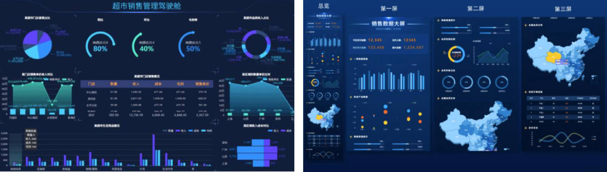

# ECharts 是什么

- ECharts（全称 Enterprise Charts ）是企业级数据图表。官方的解释是：一个基于 JavaScript 的开源可视化图表库。
- ECharts 可以流畅的运行在 PC 和移动设备上，兼容当前绝大部分浏览器（IE6/7/8/9/10/11，chrome，firefox，Safari等）。
- ECharts 底层依赖轻量级的 ZRender 图形库，可提供直观，生动，可交互，可高度个性化定制的数据可视化图表。

# Echarts 的发展历史

1. ECharts 由百度团队开源
2. 2018 年初，捐赠给 Apache 基金会，成为 Apache 软件基金会孵化级项目。
3. 2021 年 1 月 26 日晚，Apache 基金会官方宣布 ECharts 项目正式毕业，成为 Apache 顶级项目。
4. 2021 年 1 月 28 日，ECharts5 线上发布会举行。

# ECharts 的应用场景

智慧城市、园区、航运、公安、机房、监所、电力、物业、应急管理等多个领域的数据可视化展示。



# ECharts 的特点

丰富的图表类型
- 提供开箱即用的 20 多种图表和十几种组件，
- 支持各种图表以及组件的任意组合；

强劲的渲染引擎
- Canvas、SVG 双引擎灵活切换，增量渲染等技术实现千万级数据的流畅交互；

简单易容，上手容易
- 直接通过编写配置，便可以生成各种图表，并且支持多种集成方式；

活跃的社区
- 活跃的社区用户保证了项目的健康发展，也贡献了丰富的第三方插件满足不同场景的需求；

等等

# ECharts 初体验

集成 Echarts 的常见方式：

- 通过 jsDelivr 等 CDN 引入。
- 通过 npm 获取 echarts：`npm install echarts --save`

> ECharts 的容器必须设高度。

04-Echart\demo-project\01-ECharts初体验\01-ECharts初体验.html

```html
<body>
	<!-- 作为 ECharts 的容器，必须要有高度 -->
	<div id="main" style="height: 400px;"></div>

	<script src="https://cdn.jsdelivr.net/npm/echarts@5.4.1/dist/echarts.min.js"></script>
	<script>
		window.onload = function () {
			// 1.初始化 echarts 实例
			const myChart = echarts.init(document.getElementById('main'))

			// 2.指定图表的配置项和数据
			const option = {
				title: {
					text: 'ECharts 入门示例'
				},
				tooltip: {},
				legend: {
					data: ['销量']
				},
				xAxis: {
					data: ['衬衫', '羊毛衫', '雪纺衫', '裤子', '高跟鞋', '袜子']
				},
				yAxis: {},
				series: [
					{
						name: '销量',
						type: 'bar',
						data: [5, 20, 36, 10, 10, 20]
					}
				]
			}

			myChart.setOption(option)
		}
	</script>
</body>
```

# ECharts 渲染原理

浏览器端的图表库大多会选择 SVG 或者 Canvas 进行渲染。 

- ECharts 最初一直都是使用 Canvas 绘制图表。直到 ECharts v4.0 版本，才支持 SVG 渲染器。 
- SVG 和 Canvas 渲染在技术上有很大的差异，EChart 能够做到同时支持，主要归功于 ECharts 底层使用 ZRender 库进行抽象和实现。

- ZRender 是二维轻量级的绘图引擎，它提供 Canvas、SVG、VML 等多种渲染方式。 
- 因此，Echarts 可以轻松的互换 SVG 和 Canvas 渲染器。切换渲染器只须在初始化图表时设置 `{renderer: canvas}` 或 `{renderer: canvas}` 即可。

svg 和 canvas 渲染模式应如何选择？


# option 配置项（组件）
# grid 网格配置
# xAsis，yAsis 坐标系配置
# series 系列图配置
- data 属性的使用
- type 属性的使用
	- 实现柱状图
	- 实现折线图
	- 实现散点图
	- 实现饼图
	- 实现圆环图
	- 实现玫瑰图
- label 属性的使用
- itemStyle 属性的使用，它可以放在 data 中使用。
- emphasis 属性的使用，它可以放在 data 中使用。

# title 标题配置
