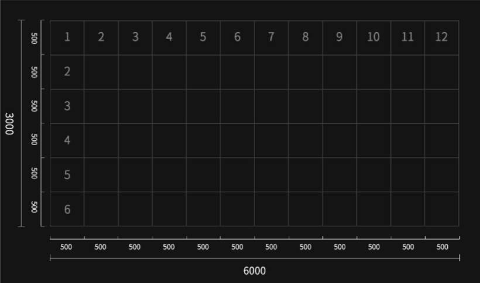
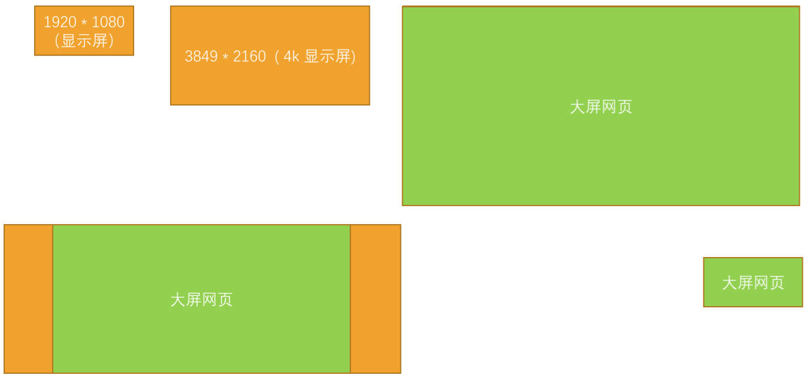

# 一、认识大屏设备

## 1.什么是大屏？

在开发网页时，适配最多的屏幕尺寸是：
- PC 端电脑屏幕：1920px * 1080px（也有 4k 屏的情况）
- 移动设备：750px * auto

那什么是大屏设备？
- 指挥大厅、展厅、展会中的大屏。这些设备就可以称之为大屏设备；
- 当然 1920 × 1080 和 3840 × 2160（4k 屏）也可以说是属于大屏。

大屏的应用场景
- 数据可视化，借助于图形化手段，清晰有效地传达与沟通信息。
- 比如用在：零售、物流、电力、水利、环保、交通、医疗等领域。

大屏的硬件设备的分类：

- 拼接屏、LED 屏、投影等。

## 2.什么是拼接屏？

拼接屏就是很多屏幕按照某种排列方式拼接而成。
- 常见的使用场景有指挥大厅、展厅、展会等等。

拼接方式取决于使用场景的需求，如下例子：
- 1920px * 1080px，即 1 * 1 个显示屏（16 : 9）
- 3840 * 2160（4k 屏），即 2 * 2 个显示屏（16 : 9）
- 5760 * 3240，即 3 * 3 个显示屏（16 : 9）
- 7680 * 3240，即 4 * 3 个显示屏（64 : 27）
- 9600 * 3240，即 5 * 3 个显示屏（80 : 27）

## 3.什么是 LED 屏？

LED 也是现在大屏中常用的硬件，它是由若干单体屏幕模块组成的，它的像素点计算及拼接方式与拼接屏有很大区别。

LED 可以看成是矩形点阵，具体拼接方式也会根据现场实际情况有所不同，拼接方式的不同直接影响到设计的尺寸规则。

LED 屏有很多规格，各规格计算方法相同。

- 比如，我们用单体为 500 * 500 的作为标准计算，每个单体模块像素点横竖都为 128px
- 如下图，横向 12 块竖向 6 块，横向像素为 128×12=1536px，竖向 128×6=768px。可以使用横竖总像素去设计。
- 最终算出的屏幕尺寸：1536px * 768px

# 二、定设计稿尺寸

## 1.大屏设计稿定稿

普通大屏，拼接屏，LED 屏幕，定设计稿：

因为超过 4K 后现容易造成卡顿，GPU 压力过大，高负荷运行等等问题，设计稿应保持在 4K 左右，参照大屏的比例等比例缩放，比如：

- 1920px * 1080px（1*1），设计搞尺寸：1920px * 1080px。
- 3840 * 2160（2*2 4k 屏 ），设计搞尺寸：3840px * 2160px。
- 5760 * 3240（3*3），设计搞尺寸：5760px * 3240px。
- 7680 * 3240（4*3），设计搞尺寸：3840px * 1620px，需要出1倍图和2倍图，
- 9600 * 3240（5*3），设计搞尺寸：4800px * 1620px，需要出1倍图和2倍图。

> 特殊尺寸没有必要专门适配，不可能一稿通吃。
>
> 这种情况应该优先考虑目标屏幕的适配，要针对性设计，而在特殊尺寸屏幕中，进行等比例缩放显示，这才是最佳的解决方法。

## 2.移动端屏目设计稿定稿

基本上，按照实际尺寸设计即可，比如：750px * Auto，设计搞尺寸：750px * Auto 。

# 三、浏览器新建大屏设备

在学习大屏适配之前，先来创建几个大屏设备，方便学习和测试。

1. 在 chrome 浏览器中，打开 DevTools 页面。
2. 在选择设备下拉栏中，点击最后一个选项 Edit。
3. 然后在 Emulated Devices 中点击 Add custom device
4. 最后在 Device 面板中输入设备信息，并点击 Add 按钮完成设备的新建。
	- 这里分别新建：1920 * 1080 、 3840 * 2160 、 7680 * 2160

# 四、大屏适配方案

## 1.rem 适配方案

rem + 动态设置 html 的 font-size；

回顾动态改变 html 的 font-size 的方案（示例中采用 lib_fleible.js 库）。

回顾 rem 单位与 px 单位的换算方案。

05-大屏项目实战\demo-project\01-大屏适配方案一(rem+fontsize)\02-使用rem+fontsize实现大屏的适配.html

## 2.vw 适配方案

回顾 vw 单位与 px 单位换算的方案。

05-大屏项目实战\demo-project\02-大屏适配的方案二(vw)\01-使用vw实现大屏的适配.html
